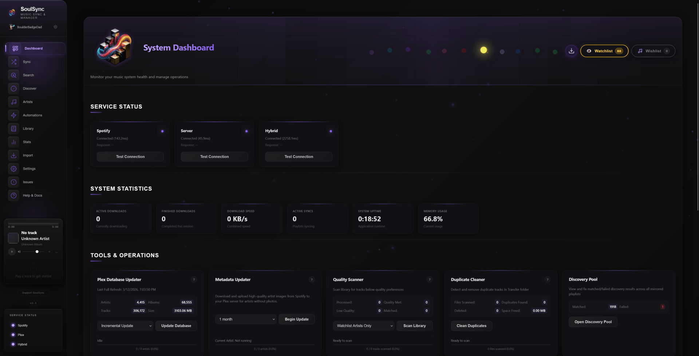

<p align="center">
  
</p>

# SoulSync - Intelligent Music Discovery & Automation Platform

**Spotify-quality music discovery for self-hosted libraries.** Automates downloads, curates playlists, monitors artists, and organizes your collection with zero manual effort.

> **IMPORTANT**: Configure file sharing in slskd to avoid Soulseek bans. Set up shared folders at `http://localhost:5030/shares`.

**Community**: [Discord](https://discord.gg/wGvKqVQwmy) | **Support**: [GitHub Issues](https://github.com/Nezreka/SoulSync/issues) | **Donate**: [Ko-fi](https://ko-fi.com/boulderbadgedad)

---

## What It Does

SoulSync bridges streaming services to your media server with automated discovery:

1. **Monitors artists** → Automatically detects new releases
2. **Generates playlists** → Release Radar, Discovery Weekly, Seasonal, Decade/Genre mixes
3. **Downloads missing tracks** → From Soulseek, Beatport charts, playlists
4. **Enriches metadata** → LRC lyrics, album art, proper tags
5. **Organizes files** → Custom templates for clean folder structures
6. **Syncs media server** → Plex, Jellyfin, or Navidrome stay updated

---

## Key Features

<p align="center">
  
</p>

### Discovery Engine

**Release Radar** - 30 new tracks from watchlist artists (updates daily)

**Discovery Weekly** - 50 tracks from similar artists using custom algorithm
- 20 popular + 20 mid-tier + 10 deep cuts
- Built from 1000+ track discovery pool
- Refreshes every 24 hours

**Seasonal Playlists** - Halloween, Christmas, Valentine's, Summer, Spring, Autumn (auto-generated)

**Personalized Playlists** (12+ types)
- Recently Added, Top Tracks, Forgotten Favorites
- Decade Playlists (1960s-2020s), Genre Playlists (15 categories)
- Daily Mixes, Hidden Gems, Popular Picks, Custom Builder

**ListenBrainz** - Import recommendation and community playlists

**Beatport** - Electronic music charts by genre (House, Techno, Trance, etc.)
- Top 100, Hype Charts, DJ Charts, Staff Picks

### Multi-Source Downloads

**Sources**: Soulseek (FLAC priority), YouTube (Audio), Beatport charts, Spotify/Tidal playlists

**Features**
- Quality profiles: Audiophile, Balanced, Mobile
- Automatic format fallback (FLAC → MP3)
- Duplicate prevention against library
- Batch processing with retry logic
- Synchronized lyrics (LRC) for every track

### Metadata & Reliability

**Dual-Source System**
- **Primary**: Spotify (Preferred for richer data and discovery features)
- **Backup**: iTunes (No authentication required)
- **Redundancy**: System automatically manages both sources. If Spotify is authorized, it is prioritized. If Spotify is unavailable, rate-limited, or unauthorized, SoulSync **seamlessly switches to iTunes** for metadata, cover art, and artist tracking.
- **Fail-Safe**: Even with Spotify authorized, iTunes metadata is maintained as a redundant layer to ensure zero downtime.


### Advanced Matching

- Unicode/accent handling (KoЯn, Björk, A$AP Rocky)
- Fuzzy matching with confidence scoring
- Album variation detection (Deluxe, Remastered, etc.)
- Multi-strategy: exact → normalized → fallback

### Automation

**Watchlist** - Monitor unlimited artists, auto-discover similar artists via music-map.com

**Wishlist** - Failed downloads retry every 30 minutes automatically

**Background Tasks** - Database sync, discovery pool updates, seasonal content

### Library Management

- **Quality Scanner** - Find low-bitrate files to replace
- **Duplicate Cleaner** - Identify redundant tracks
- **Completion Tracking** - Album progress percentages
- **Enhanced Search** - Unified search across Spotify, library, Soulseek
- **Template Organization** - `$albumartist/$album/$track - $title` (fully customizable)

---

## Installation

### Docker (Recommended)

```bash
curl -O https://raw.githubusercontent.com/Nezreka/SoulSync/main/docker-compose.yml
docker-compose up -d
# Access at http://localhost:8008
```

### Python

```bash
git clone https://github.com/Nezreka/SoulSync
cd SoulSync
pip install -r requirements-webui.txt
python web_server.py
# Open http://localhost:8008
```

---

## Setup Guide

### Prerequisites

- **slskd** running and accessible ([Download](https://github.com/slskd/slskd/releases))
- **Spotify API** credentials ([Dashboard](https://developer.spotify.com/dashboard))
- **Media Server** (optional): Plex, Jellyfin, or Navidrome

### Step 1: Set Up slskd

SoulSync talks to slskd through its API, so you need an API key.

**Getting your slskd API key:**
1. Open your slskd web UI (usually `http://localhost:5030`)
2. Go to the settings/options page
3. Find the API keys section - if there isn't one already set, you'll need to add one in your slskd config file (`settings.yml`)
4. In your slskd config, under `web` > `authentication` > `api_keys`, add a key. It can be literally anything, just make it long enough. Example:
   ```yaml
   web:
     authentication:
       api_keys:
         my_key:
           key: "12345678910111213"
   ```
5. Restart slskd after adding the key
6. Copy that same key - you'll paste it into SoulSync's settings

**Making sure SoulSync can see slskd's downloads:**

This is the part that trips people up. slskd downloads files to a folder on your system, and SoulSync needs to be able to see that same folder. If both are running in Docker, you need to make sure they're pointed at the same place on disk.

For example, if slskd downloads to `/mnt/user/Music/Downloads` on your host machine, SoulSync needs a volume mapping that points to that same host folder. In your SoulSync docker-compose or container config, map it like:

```yaml
volumes:
  - /mnt/user/Music/Downloads:/app/downloads
```

Then in SoulSync's settings, set the download path to `/app/downloads` (the container path, not the host path).

Same idea for the transfer/library folder - wherever you want your organized music to end up, map that host folder into the container and use the container path in SoulSync's settings.

**Configure file sharing in slskd to avoid Soulseek bans.** Soulseek expects you to share files. Set up shared folders at `http://localhost:5030/shares`.

### Step 2: Set Up Spotify API

Spotify is optional but gives you the best discovery features (playlists, recommendations, metadata). Without it, SoulSync falls back to iTunes for search and metadata which works fine for basic downloading.

If you want Spotify features:
1. Go to [developer.spotify.com/dashboard](https://developer.spotify.com/dashboard) and create an app
2. In the app settings, add this as a Redirect URI: `http://127.0.0.1:8888/callback`
3. Copy your Client ID and Client Secret - you'll paste these into SoulSync's settings page

**If you're accessing SoulSync from a different machine than where it's running** (like a server), the Spotify OAuth callback can be tricky. Spotify redirects to `127.0.0.1` which points to your browser's machine, not the server. You have two options:
- When it redirects, manually change `127.0.0.1` in the URL bar to your server's IP, then hit enter
- Set up SSH port forwarding: `ssh -L 8888:localhost:8888 user@your-server-ip`, then do the auth from that terminal session

More detail in [Support/DOCKER-OAUTH-FIX.md](Support/DOCKER-OAUTH-FIX.md).

### Step 3: Configure SoulSync

Open SoulSync at `http://localhost:8008` (or your server's IP) and go to Settings.

**slskd Connection:**
- **slskd URL**: If both containers are on the same machine, use `http://host.docker.internal:5030`. If that doesn't work, use your machine's local IP like `http://192.168.1.100:5030`. Don't use `localhost` - that refers to inside the SoulSync container itself.
- **API Key**: Paste the API key you set up in slskd's config

**Paths:**
- **Download Path**: This should be the container path where slskd's downloads are mapped. If you followed the volume mapping above, that's `/app/downloads`
- **Transfer Path**: This is where SoulSync puts your organized/renamed music. The default is `/app/Transfer` - just make sure you have a volume mapping for it

**Media Server** (optional):
- **Plex/Jellyfin/Navidrome URL**: Use your machine's actual IP address, not `localhost`. For example `http://192.168.1.100:32400` for Plex. Same reason as slskd - `localhost` inside Docker means the container, not your host machine.

### Step 4: Docker Path Mapping

This is where most issues come from. The key concept: SoulSync runs inside a Docker container and can only see folders you explicitly map in. Paths inside the container are different from paths on your host machine.

**What you need mapped:**

| What | Container Path | Host Path (your system) |
|------|---------------|------------------------|
| Config | `/app/config` | Wherever you want config stored |
| Logs | `/app/logs` | Wherever you want logs stored |
| Database | `/app/data` | Use a named volume (see below) |
| slskd Downloads | `/app/downloads` | Same folder slskd downloads to |
| Music Library/Transfer | `/app/Transfer` | Where you want organized music to go |

**Example docker-compose volumes for Linux:**
```yaml
volumes:
  - ./config:/app/config
  - ./logs:/app/logs
  - soulsync_database:/app/data
  - /path/to/slskd/downloads:/app/downloads
  - /path/to/music/library:/app/Transfer
```

**Example for Unraid:**
```yaml
volumes:
  - /mnt/user/appdata/soulsync/config:/app/config
  - /mnt/user/appdata/soulsync/logs:/app/logs
  - soulsync_database:/app/data
  - /mnt/user/Music/Downloads:/app/downloads
  - /mnt/user/Music/Library:/app/Transfer
```

**Important:** The database should use a named volume (`soulsync_database:/app/data`), not a direct host path mount. Mounting a host folder to `/app/database` will overwrite Python module files the app needs to run.

The paths you enter in SoulSync's settings page should always be the **container paths** (left side), not the host paths (right side). SoulSync doesn't know about your host filesystem - it only sees what's inside the container.

### Unraid Users

If you're using the Unraid template from Community Applications, double check that the container path for your music share is set to match what SoulSync actually uses. The download folder should map to `/app/downloads` and your library/transfer folder should map to `/app/Transfer`. Then use those same container paths in SoulSync's settings page.

---

## Who Should Use This

**Perfect for:**
- Self-hosters with Plex/Jellyfin/Navidrome
- Music enthusiasts with 500+ album collections
- Electronic music fans (Beatport integration)
- Former Spotify users wanting local discovery

**Not ideal for:**
- Casual users wanting simple sync
- Slow/metered internet connections
- Users uncomfortable with APIs or Docker

---

## Comparison

| Feature | SoulSync | Lidarr | Headphones | Beets |
|---------|----------|--------|------------|-------|
| Custom Discovery Algorithm | ✓ | ✗ | ✗ | ✗ |
| Personalized Playlists (12+) | ✓ | ✗ | ✗ | ✗ |
| Beatport Integration | ✓ | ✗ | ✗ | ✗ |
| ListenBrainz Playlists | ✓ | ✗ | ✗ | ✗ |
| Multi-Source (Spotify/Tidal/YouTube) | ✓ | ✓ | ✗ | ✗ |
| Watchlist Monitoring | ✓ (100+) | ✓ | ✓ | ✗ |
| LRC Lyrics | ✓ | ✗ | ✗ | Plugin |
| Advanced Matching | ✓ | ✗ | ✗ | ✓ |
| Quality Scanner + Duplicate Cleaner | ✓ | ✗ | ✗ | ✓ |
| Template-Based Organization | ✓ | ✗ | ✗ | ✓ |
| Seasonal Playlists | ✓ | ✗ | ✗ | ✗ |

**SoulSync is the only tool combining intelligent discovery with multi-source automation and library management.**

---

## Architecture

**Scale**: 83,000+ lines Python, 120+ API endpoints, handles 10,000+ album libraries

**Integrations**: Spotify, Tidal, YouTube, Plex, Jellyfin, Navidrome, Slskd, ListenBrainz, LRClib, music-map.com, Beatport

**Stack**: Python 3.8+, Flask, SQLite, PyQt6 (desktop GUI in maintenance mode)

**Core Components**:
- Matching engine with Unicode/fuzzy logic
- Discovery system with custom algorithms
- Download pipeline with quality profiles
- Metadata enhancement (lyrics, art, tags)
- Template-based file organization

---

## File Organization

**Default Structure**
```
Transfer/Artist/Artist - Album/01 - Track.flac
```

**Custom Templates**
- Albums: `$albumartist/$albumartist - $album/$track - $title`
- Singles: `$artist/$artist - $title/$title`
- Playlists: `$playlist/$artist - $title`
- Variables: `$artist`, `$albumartist`, `$album`, `$title`, `$track`, `$playlist`

**Features**: Client-side validation, automatic fallback, instant apply

---

## Troubleshooting

**Enable Debug Logging**: Settings → Log Level → DEBUG → Check `logs/app.log`

**Common Issues**
- **Files not organizing**: Verify transfer path, check template syntax, use "Reset to Defaults"
- **Docker paths**: Ensure drives mounted in docker-compose.yml, use `/host/mnt/X/` prefix
- **OAuth from remote**: Manually edit callback URL to server IP (Spotify requires 127.0.0.1)
- **Wishlist stuck**: Auto-retry runs every 30 mins, check logs for failures
- **Multi-library**: Select correct library in settings dropdown

---

## Roadmap

### Planned
- WebSocket support (replace polling)
- Batch wishlist operations
- Download history browser UI
- Source reliability tracking
- Notification center
- Mobile-responsive improvements

### Under Consideration
- MusicBrainz ID integration
- Additional streaming sources (Deezer, Apple Music)
- Playlist collaboration between instances
- Machine learning for matching

---

## License

MIT License - See [LICENSE](LICENSE) file for details

---

## Acknowledgments

**Services**: slskd, music-map.com, LRClib.net, Spotify, Tidal, Plex, Jellyfin, Navidrome

**Community**: Contributors, testers, and users providing feedback

---

<p align="center">
  <a href="https://ko-fi.com/boulderbadgedad">
    
  </a>
</p>

<p align="center">
  <a href="https://star-history.com/#Nezreka/SoulSync&type=date&legend=top-left">
    
  </a>
</p>
