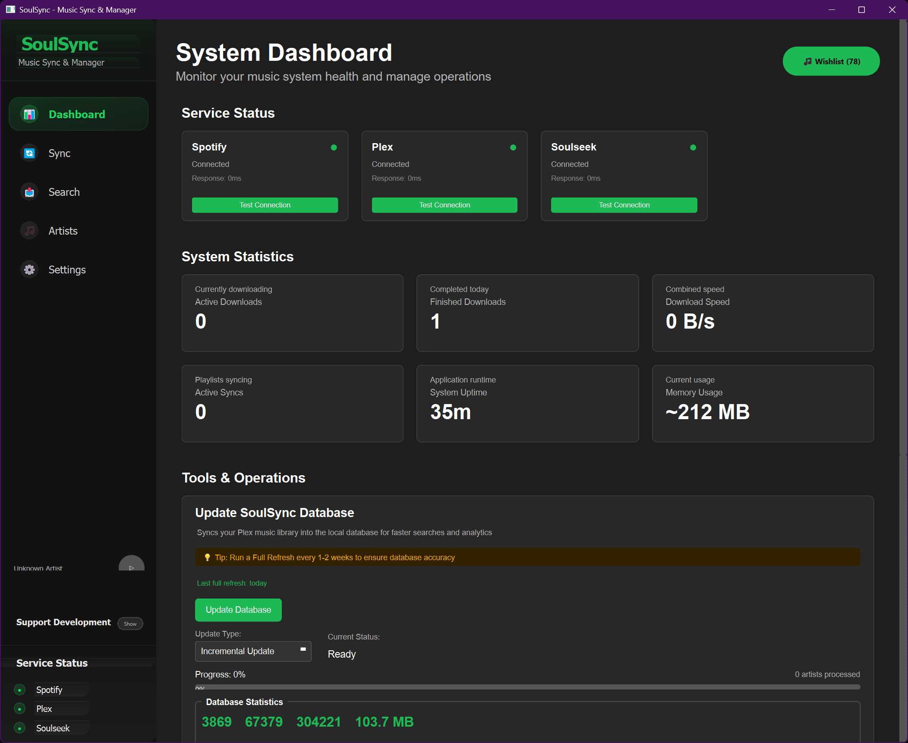

<p align="center">
  
</p>

# 🎵 SoulSync - Automated Music Discovery and Collection Manager

SoulSync is a powerful desktop application designed to bridge the gap between your music streaming habits on Spotify and your personal, high-quality music library in Plex or Jellyfin. It automates the process of discovering new music, finding missing tracks from your favorite playlists, and sourcing them from the Soulseek network via slskd.

The core philosophy of SoulSync is to let you enjoy music discovery on Spotify while it handles the tedious work of building and maintaining a pristine, locally-hosted music collection for you in your media server. Both Plex and Jellyfin are supported as media servers (though neither is required for the app to function), while slskd and Spotify API are required.

## ☕ Support Development

If you find SoulSync useful, consider supporting its development:

[](https://ko-fi.com/boulderbadgedad)



## ⚠️ Docker Support
Docker is unlikely since this is a fully GUI based app. The unique setup would be difficult for most users and my knowledge of docker is sad.

## ✨ Core Features

### 🤖 **Automation Engine**
SoulSync handles everything automatically once you set it up. You can sync multiple Spotify and YouTube playlists at the same time, and it'll prioritize FLAC files and reliable sources. When downloads finish, it organizes them into clean folder structures and updates your Plex library automatically.

The app runs a background process every 60 minutes to retry failed downloads - so if a track wasn't available earlier, it'll keep trying until it finds it. It also auto-detects your Plex or Jellyfin server and slskd on your network, backs up your playlists before making changes, and reconnects to services if they go down.

Once it's running, SoulSync basically acts like a personal music librarian that works in the background.

### 🎬 **Spotify & YouTube Integration**
Works with both Spotify and YouTube playlists. For YouTube, it extracts clean track names by removing stuff like "(Official Music Video)" and other junk from titles. For Spotify, it tracks playlist changes so it only downloads new tracks instead of re-scanning everything.

Both get the same smart matching system with color-coded confidence scores, and you can bulk download all missing tracks with progress tracking.

### 🎯 **Artist Discovery**
Search for any artist and see their complete discography with indicators showing what you already own vs what's missing. You can download entire missing discographies with one click, or just grab specific albums/tracks. It shows releases chronologically and highlights gaps in your collection.

### 🔍 **Search & Download**
The search page lets you manually hunt for specific albums or singles. Every result has a preview button so you can stream before downloading. It keeps your search history and has detailed progress tracking for downloads. Failed downloads automatically go to a wishlist for retry later.

### 🧠 **Smart Matching**
The matching engine is pretty sophisticated - it prioritizes original versions over remixes, handles weird characters (like КоЯn → Korn), and removes album names from track titles for cleaner matching. It generates multiple search variations per track to find more results and scores each match so you know how confident it is.

### 🗄️ **Local Database**
Keeps a complete SQLite database of your media server library (Plex or Jellyfin) locally, so matching is instant instead of making slow API calls. Updates automatically when files change and handles thousands of songs without slowing down.

### 📁 **File Organization**
Downloads get organized automatically based on whether they're album tracks or singles. Creates clean folder structures like `Transfer/Artist/Artist - Album/01 - Track.flac`. Supports all common audio formats and automatically tags everything with proper metadata and album art from Spotify.

### 🎵 **Built-in Player**
You can stream tracks directly from Soulseek before downloading to make sure they're the right ones. Supports all common audio formats and the player works across all pages in the app.

### 📋 **Wishlist System**
Failed downloads automatically get saved to a wishlist with context about where they came from. The app tries to download wishlist items every hour automatically. You can also manually retry or bulk manage failed downloads.

### 👀 **Watchlist Monitoring**
Track your favorite artists automatically by adding them to your watchlist. SoulSync monitors watched artists for new releases and automatically scans their latest albums and singles against your library. When new tracks are found missing, they're added to your wishlist for download. The system runs comprehensive scans with intelligent rate limiting to avoid API bans, and you can view real-time progress with detailed status updates for each artist being scanned.

### 📊 **Dashboard & Monitoring**
Real-time status for all your connections (Spotify, Plex/Jellyfin, Soulseek), download statistics, and system performance. Activity feed shows everything that's happening with timestamps.

### 🎯 **Five Main Pages**

**Downloads**: Search for music manually, preview before downloading, see progress in real-time.

**Sync**: Load Spotify/YouTube playlists, see what's missing with confidence scores, bulk download missing tracks.

**Artists**: Browse complete artist catalogs, see what you own vs missing, bulk download entire discographies.

**Dashboard**: Overview of all connections and activity, quick access to common functions.

**Settings**: Configure all your API keys and preferences, database management, performance tuning.

### 🚀 **Performance**
Multi-threaded so it stays responsive during heavy operations. Automatically manages resources, prevents Soulseek bans with rate limiting, and handles errors gracefully with automatic recovery.

## ⚙️ How It Works

The application follows a clear, automated workflow to enhance and expand your music library:

1. **Connect Services**: First, you authenticate with your Spotify account, connect to your media server (Plex or Jellyfin), and connect to your running slskd instance through the settings panel. This gives SoulSync the access it needs to work its magic.

2. **Analyze**: Navigate to the Sync page and select a Spotify playlist. SoulSync fetches all tracks and compares them against your media server library. This comparison uses a sophisticated matching engine that looks at track title, artist, album, and duration to make an accurate assessment.

3. **Identify Missing**: After the analysis, the application generates a clear, actionable list of tracks that are present in the Spotify playlist but are not found in your media server library.

4. **Search & Download**: For each missing track, SoulSync generates multiple optimized search queries to increase the likelihood of finding a high-quality match. It then uses the slskd API to search the Soulseek network, prioritizing FLAC files and reliable users, and automatically queues them for download.

5. **Organize & Enhance**: Once a download is complete, SoulSync automatically organizes the file from the download directory into the transfer directory, creating a clean folder structure based on the artist and album (`/Transfer/Artist Name/Artist Name - Album Name/Track.flac`). Immediately after organization, the metadata enhancement system enriches the file with accurate Spotify data including proper artist/album names, track numbers, release dates, genres, and high-quality embedded album art. This ensures every file emerges perfectly tagged and ready for your media server, requiring no manual metadata editing.

## 🚀 Getting Started

Follow these steps to get SoulSync up and running on your system.

### ⚠️ Important Soulseek Sharing Requirement

**CRITICAL**: Before using SoulSync, you MUST set up a shared folder in slskd. Users who only download without sharing are typically banned by other Soulseek users, which will severely limit your ability to find and download music. 

1. In your slskd web interface (`http://localhost:5030`), go to the **Shares** section
2. Add at least one folder containing music files to share with the network
3. The more you share, the better your reputation and download success rate will be
4. Consider sharing your organized music collection from your Plex library

### Prerequisites

Before you begin, ensure you have the following installed and configured:

- **Python 3.8+**: The core runtime for the application.
- **Media Server (OPTIONAL)**: Either Plex Media Server or Jellyfin is optional but recommended. If connected, SoulSync will scan your existing music library to identify missing tracks. Without a media server, all tracks will be considered "missing" and automatically downloaded.
- **slskd**: A headless Soulseek client. This is the engine that powers the downloading feature. See detailed setup instructions below.
- **Spotify Account**: A regular or premium Spotify account is required to access your playlists and artist data.

### Setting Up slskd

This application requires **slskd**, a web-based Soulseek client, to handle music downloads. Here's how to set it up:

#### Installing slskd

**Option 1: Manual Installation (RECOMMENDED)**
1. Download the latest release from [slskd GitHub releases](https://github.com/slskd/slskd/releases)
2. Extract and run the executable
3. Default web interface will be available at `http://localhost:5030`

**Option 2: Docker (MAYBE? UNTESTED)**
```bash
# Create directories for slskd
mkdir -p ~/slskd/{config,downloads,incomplete}

# Run slskd container
docker run -d \
  --name slskd \
  -p 5030:5030 \
  -p 50300:50300 \
  -v ~/slskd/config:/app/config \
  -v ~/slskd/downloads:/app/downloads \
  -v ~/slskd/incomplete:/app/incomplete \
  slskd/slskd:latest
```

#### Configuring slskd

1. **Initial Setup**: Open `http://localhost:5030` in your browser
2. **Create Account**: Set up your admin username and password  
3. **Soulseek Credentials**: Enter your Soulseek username and password
4. **API Key**: Create a random 16-character API key:
   - Generate a random string (letters and numbers) like `abc123def456ghi7`
   - Add this to your slskd configuration file as the API key
   - Use the same key in SoulSync configuration
5. **CONFIG SETUP**: An application directory will be created in either ~/.local/share/slskd (on Linux and macOS) or %localappdata%/slskd (on Windows). In the root of this directory the file slskd.yml will be created the first time the application runs. Edit this file to enter your credentials for the Soulseek network, and tweak any additional settings using the

**Important Notes:**
- slskd must be running before starting SoulSync
- Make sure your Soulseek account has sharing enabled to avoid connection issues
- The default port 5030 can be changed in slskd settings if needed

### Installation

1. **Clone the repository**:
   ```bash
   git clone https://github.com/Nezreka/SoulSync
   cd soulsync-app
   ```

2. **Install dependencies**:
   ```bash
   pip install -r requirements.txt
   ```

### ⚠️ First-Time Setup: A Critical Step

**IMPORTANT**: SoulSync will not function until you provide your API keys and service details. You must do this before you start using the app's features. You have two options for this initial setup:

#### Option 1 (Recommended): Use the In-App Settings Page

1. Launch the application (`python main.py`).
2. The very first thing you should do is navigate to the **Settings** page using the sidebar.
3. Fill in the required fields for Spotify and Soulseek. Media server configuration (Plex or Jellyfin) is optional but recommended.
4. Click "Save Settings". The app is now ready to use.
5. Restart the app for good luck.

#### Option 2: Edit the config.json File Manually

1. **Locate the Configuration File**: Before launching the app, find the `config.json` file in the `config/` directory of the project.
2. **Configure API Keys and URLs**: Open the file and fill in the details as described below.

### Configuration Details

Open the `config.json` file and fill in the details for Spotify, your media server (Plex or Jellyfin), and Soulseek.

#### 🔑 Obtaining Required API Credentials

Before configuring SoulSync, you'll need to obtain API credentials from Spotify and your media server. Here's how:

##### Spotify Client ID and Secret

**Step 1: Create a Spotify App**
1. Go to the [Spotify Developer Dashboard](https://developer.spotify.com/dashboard)
2. Log in with your Spotify account
3. Click "Create App"
4. Fill in the required information:
   - **App name**: "SoulSync" (or any name you prefer)
   - **App description**: "Music library sync application"
   - **Redirect URI**: `http://localhost:8888/callback` (or leave blank)
   - Check the boxes to agree to the Terms of Service
5. Click "Save"

**Step 2: Get Your Credentials**
1. In your newly created app, click "Settings"
2. Copy the **Client ID** - this is your `client_id`
3. Click "View client secret" to reveal and copy the **Client Secret** - this is your `client_secret`

##### Plex Token

**Method 1: Through Plex Web Interface (Recommended)**
1. Open Plex in your web browser and sign in
2. Right-click anywhere on the page and select "Inspect" or press F12
3. Go to the **Network** tab in Developer Tools
4. Reload the page
5. Look for requests to `plex.tv` or your Plex server
6. In the request headers, find `X-Plex-Token` - copy this value

**Method 2: Using Browser Console**
1. Go to [plex.tv](https://plex.tv) and sign in
2. Open Developer Tools (F12) and go to the **Console** tab
3. Type: `localStorage.myPlexAccessToken` and press Enter
4. Copy the returned token value (without quotes)

**Method 3: Through Media Item XML (Easy)**
1. Open Plex in your web browser and navigate to any media item
2. Click on the item to view its details
3. Click "View XML" or right-click and select "View XML"
4. In the URL bar, you'll see a URL like: `http://your-server:32400/library/metadata/12345?X-Plex-Token=YOUR_TOKEN_HERE`
5. Copy the token from the `X-Plex-Token=` parameter in the URL

**Method 4: Using Plex API**
1. Make a POST request to `https://plex.tv/users/sign_in.xml`
2. Include your Plex username and password in the request
3. Extract the authentication token from the XML response

**Finding Your Plex Server URL:**
- Local network: `http://[YOUR_PLEX_SERVER_IP]:32400` (e.g., `http://192.168.1.100:32400`)
- Same machine: `http://localhost:32400`
- To find your server IP, check your Plex server settings or use your router's admin panel

##### Jellyfin API Key

**Method 1: Through Jellyfin Dashboard (Recommended)**
1. Open your Jellyfin web interface and sign in as an administrator
2. Go to **Dashboard** → **API Keys**
3. Click **New API Key**
4. Enter an **App Name** (e.g., "SoulSync") 
5. Click **Create**
6. Copy the generated API key immediately (it won't be shown again)

**Method 2: Through User Settings**
1. Go to **Dashboard** → **Users**
2. Click on your user account
3. Go to the **API Keys** tab
4. Create a new API key as described above

**Finding Your Jellyfin Server URL:**
- Local network: `http://[YOUR_JELLYFIN_SERVER_IP]:8096` (e.g., `http://192.168.1.100:8096`)
- Same machine: `http://localhost:8096`
- HTTPS: `https://[YOUR_JELLYFIN_SERVER_IP]:8920` (if configured)

**Note**: SoulSync uses Jellyfin's REST API for library access. Make sure your Jellyfin user has permissions to access the music library.

#### 📁 Important: Understanding Download vs Transfer Folders

- **download_path**: This should be the exact same folder where slskd saves its downloads (e.g., the downloads folder you configured in slskd). SoulSync monitors this folder for completed downloads.
- **transfer_path**: This is where SoulSync moves and organizes the processed files. Typically, this should be your main media server music library folder, so the files are immediately available to your media server after processing.

#### ❗ Important: slskd API Key Setup

The slskd API key is crucial for the application to communicate with your Soulseek client.

1. **Find your slskd config file**: This is typically a `slskd.yml` or `slskd.json` file located where you installed slskd.
2. **Locate the API key**: Inside the slskd configuration, find the `api_key` value you have set. It will look something like this:
   ```yaml
   # slskd.yml example
   api:
     key: "your-secret-api-key-goes-here"
   ```
3. **Copy and Paste**: Copy the exact API key from your slskd configuration.
4. **Update config.json**: Paste the key into the `api_key` field under the `soulseek` section in the SoulSync app's `config.json` file.

Alternatively, you can paste this key directly into the API Key field in the Settings menu within the application after launching it.

```json
{
  "spotify": {
    "client_id": "<YOUR_SPOTIFY_CLIENT_ID>",
    "client_secret": "<YOUR_SPOTIFY_CLIENT_SECRET>"
  },
  "plex": {
    "base_url": "<YOUR_PLEX_SERVER_URL>",
    "token": "<YOUR_PLEX_TOKEN>"
  },
  "jellyfin": {
    "base_url": "<YOUR_JELLYFIN_SERVER_URL>",
    "api_key": "<YOUR_JELLYFIN_API_KEY>",
    "user_id": "<YOUR_JELLYFIN_USER_ID>"
  },
  "soulseek": {
    "slskd_url": "<YOUR_SLSKD_URL>",
    "api_key": "<YOUR_SLSKD_API_KEY>",
    "download_path": "./path/to/slskd/download/folder",
    "transfer_path": "./path/to/music/folder"
  },
  "server": {
    "active_media_server": "plex"
  },
  "logging": {
    "path": "logs/app.log",
    "level": "INFO"
  },
  "settings": {
    "audio_quality": "flac"
  },
  "database": {
    "path": "database/music_library.db",
    "max_workers": 5
  },
  "metadata_enhancement": {
    "enabled": true,
    "embed_album_art": true
  },
  "playlist_sync": {
    "create_backup": true
  }
}
```

**Note**: Set `"active_media_server"` to either `"plex"` or `"jellyfin"` depending on which media server you want to use. You only need to configure the server you plan to use.

## 🖥️ Usage

Run the main application file to launch the GUI:

```bash
python main.py
```
or for mac:
```bash
python3 main.py
```

### Application Pages

- **Dashboard**: Real-time system overview with service connection matrix (Spotify/Plex/Jellyfin/Soulseek status), live download statistics (active transfers, speeds, queue status), database health metrics (size, sync status, last update), chronological activity feed of all application events, and quick action buttons for common operations.

- **Sync**: Advanced playlist management featuring Spotify playlist loading with snapshot-based change detection, confidence-scored track matching with color-coded indicators, bulk "Download Missing Tracks" with progress tracking, intelligent retry logic for failed downloads, and detailed match analysis showing why tracks were or weren't found in your media server library.

- **Downloads**: Comprehensive download management with unified Albums/Singles search interface, stream-before-download capability for every result, matched download system with artist/album selection modals, real-time progress monitoring with queue positions, failed download recovery via integrated wishlist access, and persistent search history across sessions.

- **Artists**: Complete discography explorer with full artist catalog browsing, ownership status indicators for every album, chronological release timeline with media server library overlay, bulk download operations for entire discographies, album-level missing track downloads, and integration with matched download system for accurate metadata assignment.

- **Settings**: Service configuration hub for Spotify/Plex/Jellyfin/Soulseek credentials, media server selection, download/transfer path management, metadata enhancement controls (enable/disable automatic tagging and album art embedding), database operations (update, rebuild, health check), performance tuning options (thread limits, cache settings), notification preferences, and application logging controls.

## 🐍 Key Components

The application is built on a modern, layered architecture with distinct separation of concerns:

- **main.py**: PyQt6 application entry point with main window management, service initialization, media player signal routing, and application lifecycle management.

- **core/**: Business logic and service integration layer
  - `spotify_client.py`: Spotify Web API integration with OAuth2 authentication, playlist/artist data retrieval, and metadata normalization.
  - `plex_client.py`: Plex Media Server API client with library scanning, metadata retrieval, and server status monitoring.
  - `jellyfin_client.py`: Jellyfin Media Server API client with library scanning, metadata retrieval, and server status monitoring.
  - `soulseek_client.py`: slskd API communication handling search operations, download management, and queue monitoring.
  - `matching_engine.py`: Advanced metadata comparison engine with version-aware scoring, text normalization, and confidence calculation.
  - `wishlist_service.py`: Failed download management with retry mechanisms and source context preservation.
  - `media_scan_manager.py`: Intelligent media server library scan coordination with debouncing and periodic updates.

- **database/**: Data persistence and management layer
  - `music_database.py`: SQLite database operations with thread-safe connections, WAL mode, and metadata synchronization.
  - `music_library.db`: Local database storing complete media server library metadata for instant access.

- **ui/**: Modern PyQt6 user interface with responsive design
  - `sidebar.py`: Navigation sidebar with integrated media player, service status indicators, and scrolling track info.
  - `components/`: Reusable UI elements including toast notifications, loading animations, and database status widgets.
  - `pages/`: Application pages (`dashboard.py`, `sync.py`, `downloads.py`, `artists.py`, `settings.py`) with specialized workflows.

- **services/**: Background service layer
  - `sync_service.py`: High-level sync orchestration with playlist analysis and download coordination.

- **config/**: Configuration management
  - `config.json`: Service credentials, paths, and application settings.
  - `settings.py`: Configuration file handling and validation.

- **utils/**: Shared utilities
  - `logging_config.py`: Centralized logging configuration with file and console output.

## 🤝 Contributing

Contributions are welcome! Please feel free to submit a pull request or open an issue for any bugs or feature requests.

## 📜 License

This project is licensed under the MIT License. See the LICENSE file for details.