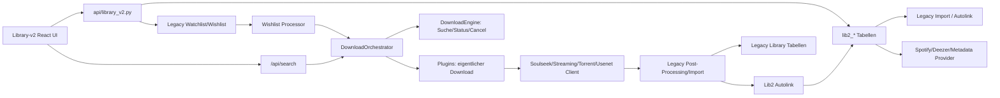
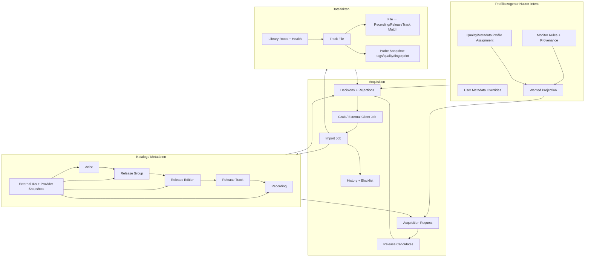

# Library v2: Architektur-, Fehler- und Umsetzungs-Audit

**Stand:** 2026-07-10  
**Branch:** `library-overhaul`  
**Commit:** `9ce5803529d502e695711bbbb30f6c65c97576af`  
**Commit-Zeit:** 2026-07-10 17:14:59 +02:00  
**Commit-Titel:** `library-v2: review-fix pass — close all deep-review findings + fill roadmap gaps`

## 1. Zweck und Ergebnis

Dieser Bericht bewertet nicht nur, ob die sichtbaren Library-v2-Funktionen vorhanden
sind. Er prüft, ob Datenmodell, Identitäten, Monitoring, Qualitätsprofile,
Metadatenabgleich, Dateiverwaltung, Jobs, Download-Pipeline und Usenet-Verarbeitung
zusammen ein belastbares System ergeben.

Das Ergebnis ist gemischt:

- Library v2 ist ein umfangreicher und brauchbarer Prototyp. Separates Schema,
  Feature-Flag, Discography-Ansicht, Qualitätsprofile, Monitoring-Aktionen, Retag,
  Artwork, History, Duplicate-Management und Repair-Job-Anbindung sind tatsächlich
  vorhanden.
- Die bestehenden Library-v2-Tests sind grün, decken aber mehrere
  Zustandsübergänge, Mehrprofil-Semantik, Wiederanlauf, Teilantworten von Providern
  und den echten manuellen Downloadweg nicht ab.
- Einige Aussagen in `STATUS.md` und `library-v2-context.md` sind stärker als die
  Implementierung. Insbesondere gelten "kein hartcodiertes Profil 1", "jeder
  Dateizugriff über den gemeinsamen Resolver", "Monitoring ist zuverlässig
  gespiegelt" und "manuelle Suche nutzt das Entity-Profil" derzeit nicht
  durchgängig.
- Vor einer breiten Aktivierung sollten zuerst die P0/P1-Befunde behoben werden.
  Besonders kritisch sind die Löschsemantik für geteilte Releases, globales
  Monitoring bei mehreren Profilen, nicht-idempotente Wishlist-Einträge, der
  ungesicherte Kandidaten-/Download-URL-Fluss und der fehlende Release-Edition-Layer.
- Usenet sollte nicht als weiterer Spezialfall in `interactive-search.tsx` oder in
  einem Plugin weiter ausgebaut werden. Zuerst braucht SoulSync einen gemeinsamen,
  entity-bezogenen Acquisition- und Decision-Layer. Danach kann Usenet sauber auf
  Release-Ebene integriert werden.

**Gesamturteil:** Noch nicht produktionsreif als neue alleinige Library-Verwaltung.
Der Branch ist eine gute Basis, benötigt aber eine Stabilisierungsschicht und bei
Release-Identität, Nutzerzustand und Acquisition eine gezielte architektonische
Weiterentwicklung.

## 2. Umfang der Prüfung

### 2.1 Vollständig gelesene Dokumente unter `docs/`

Alle sieben Dateien im Repository-Verzeichnis `docs/` wurden vollständig gelesen:

1. `docs/api-response-shapes.md`
2. `docs/download-engine-refactor-plan.md`
3. `docs/library-v2-branch-review-2026-07-06.md`
4. `docs/library-v2-context.md`
5. `docs/library-v2-plan.md`
6. `docs/media-server-engine-refactor-plan.md`
7. `docs/metadata-types-migration.md`

Zusätzlich wurde `core/library2/STATUS.md` vollständig gelesen.

Die nicht direkt Library-v2-spezifischen Dokumente sind relevant:

- Der Download-Engine-Plan verspricht zentrale Zustandsführung, Worker,
  Rate-Limits und Fallback. Suche, Status und Cancel laufen inzwischen teilweise
  über die Engine; der eigentliche Download-Dispatch und die Zustände von Torrent
  und Usenet liegen aber weiterhin in den Plugins.
- Der Media-Server-Plan bestätigt die richtige Zielrichtung: Library v2 muss aus
  Datenbank und Dateisystem funktionieren und darf keinen Media Server als
  Datenquelle voraussetzen.
- Die Metadata-Types-Migration dokumentiert noch vorhandene Mischungen aus Dicts,
  Dataclasses und providerabhängigen Shapes. Genau diese Inkonsistenz ist in
  Discography- und Tracklist-Verarbeitung weiterhin sichtbar.
- `api-response-shapes.md` zeigt, dass Providerantworten nicht einheitlich sind.
  Library v2 behandelt einige Felder weiterhin ad hoc statt über einen versionierten,
  typisierten Providervertrag.

### 2.2 Geprüfter Code

Schwerpunktmäßig geprüft wurden:

- das gesamte Paket `core/library2/`;
- `api/library_v2.py`;
- Library-v2-Repair-Jobs und Job-Registry;
- Legacy-Import, Wishlist-/Watchlist-Methoden und Import-Side-Effects;
- React-Route, API-Client, Typen, interaktive Suche und Modals;
- Download-Orchestrator und Download-Engine;
- Prowlarr, SABnzbd/NZBGet-Adapter, Torrent- und Usenet-Plugins;
- Album-Bundle-Auswahl und Post-Processing;
- zugehörige Python- und Frontendtests.

### 2.3 Vergleich mit Lidarr

Der Vergleich basiert auf dem offiziellen Lidarr-Repository und der offiziellen
Servarr-Dokumentation. Betrachtet wurden insbesondere:

- `Artist`, `Album`, `AlbumRelease`, `Track`, `TrackFile`;
- Artist-/Album-/Release-Refresh;
- `MonitorNewAlbumService`;
- `DownloadDecisionMaker`, Decision-Spezifikationen und Priorisierung;
- explizite Artist-/Album-Suchkriterien;
- Download-Client-Queue, History, Blocklist, Failed Download Handling und Remote
  Path Mappings.

Lidarr wird hier als Referenz für bewährte Domänengrenzen verwendet, nicht als
Vorlage, die vollständig kopiert werden soll.

## 3. Schweregrade und Begriffe

| Stufe | Bedeutung | Erwartete Reaktion |
|---|---|---|
| **P0** | Datenverlust, Sicherheitsgrenze oder grundlegende Zustandskorruption | Vor breiter Aktivierung beheben; betroffene Aktion notfalls sperren |
| **P1** | Hohe Wahrscheinlichkeit falscher Downloads, falscher Zustände oder nicht wiederherstellbarer Abläufe | Vor Migration zur primären Library beheben |
| **P2** | Zuverlässigkeit, Performance, UX oder mittelfristige Wartbarkeit | Im nächsten Ausbauzyklus beheben |
| **P3** | Produktlücke oder Verbesserung ohne akute Integritätsgefahr | Geplant nach Stabilisierung umsetzen |

"Belegt" bedeutet in diesem Bericht entweder:

- durch einen gezielten Test reproduziert,
- durch einen vorhandenen fehlschlagenden Test belegt oder
- aus einem vollständigen, deterministischen Codepfad ableitbar.

## 4. Verifikationsstand

### 4.1 Erfolgreiche Prüfungen

| Prüfung | Ergebnis |
|---|---|
| `pytest tests/library2 tests/repair/test_job_scope.py -q` | **81 passed** in 33.45 s |
| Prowlarr/Usenet/Download-Engine/Orchestrator-Fokus | **154 passed** in 3.33 s |
| `npm run build` | erfolgreich, 901 Module transformiert |
| Leerer Scan-Scope | reproduziert: `album_ids=[]` liefert alle Dateien |
| Doppelte Wishlist-ID | reproduziert: gleicher Track/gleiches Album ergibt Basis- und Composite-ID |

### 4.2 Fehlgeschlagene oder auffällige Prüfungen

| Prüfung | Ergebnis | Einordnung |
|---|---|---|
| `npx oxlint --type-check src/routes/library-v2` | **19 Fehler, 8 Warnungen** | Hauptursache: eingecheckte `routeTree.gen.ts` kennt `/library-v2` nicht |
| `npm test` | **89 passed, 3 failed** | Ein Library-v2-naher Manifest-Test ist veraltet; zwei weitere Fehler betreffen Stats-Locale und Import-UI |
| Frontend-Bundle | Hauptchunk ca. **1.09 MB** | Build-Warnung; Route ist nicht lazy geladen |
| Generierte Route | Build/Vitest verändern `routeTree.gen.ts` | Eingecheckter Stand ist nicht reproduzierbar/CI-stabil |

Die drei Vitest-Fehler sind:

1. `route-manifest.test.ts` erwartet die React-Routen ohne `library-v2`, obwohl das
   Manifest die Route bereits enthält.
2. `stats.helpers.test.ts` erwartet `1,240`, erhält in der lokalen Schweizer Locale
   `1'240`.
3. Ein Import-Routen-Test erwartet einen Fehlertext, während die Seite im
   Loading-Zustand bleibt.

### 4.3 Nicht durchgeführt

- Kein vollständiger Python-Gesamtlauf aller Repositorytests.
- Kein destruktiver Test gegen eine reale Musikbibliothek.
- Kein Live-End-to-End-Lauf mit echtem Prowlarr, SABnzbd/NZBGet, Torrent-Client und
  getrennten Docker-Pfadansichten.
- Kein Browser-Klicktest gegen die reale Konfiguration des Nutzers.

Diese Grenzen werden in den Abnahmekriterien des Fahrplans berücksichtigt.

## 5. Tatsächlicher Phasenstatus

### Phase A: Look/Feel, Artwork, Monitoring

**Status: funktional vorhanden, aber nicht abgeschlossen.**

Vorhanden:

- React-Route, Index, Karten-/Tabellenansicht und Artist-Detail;
- lokale Artwork-Endpunkte und Thumbnail-Cache;
- Artist-, Album- und Track-Monitor-Toggles;
- Watchlist-/Wishlist-Brücke.

Offen oder fehlerhaft:

- Monitoringzustand ist global, die Zielsysteme sind profilbezogen;
- Spiegelung ist best effort und nicht transaktional;
- Artwork speichert beliebige Bildbytes als `.jpg` und setzt immer `image/jpeg`;
- Browser-Cache wird bei gleichbleibender URL nicht zuverlässig invalidiert;
- Artwork umgeht den in den Dokumenten vorgeschriebenen gemeinsamen Lib2-Resolver;
- die Artist-Karte enthält einen Button in einem Button.

### Phase B: Interactive Search und Download-Pipeline

**Status: UI vorhanden, Entity-Vertrag nicht durchgängig.**

Vorhanden:

- Suchmodal, Sortierung, Quellenanzeige und Grab-Aktion;
- Übergabe von Skip-AcoustID/Quality-Optionen;
- allgemeiner `/api/search`- und `/api/download`-Pfad.

Kernlücken:

- Library-Entity-ID und `quality_profile_id` werden beim manuellen Download nicht
  gesendet;
- Album-spezifisches Profil wird im Modal nicht verwendet;
- automatische Tracksuche entfernt den Albumkontext;
- Auto-Grab kann bei einer Trackaktion ein Albumresultat wählen;
- die Client-Seite entscheidet mit einem sehr groben eigenen Score;
- manuelle Suche und automatische Suche verwenden nicht dieselbe zentrale
  Decision-Engine;
- Usenet-Albumresultate werden als Ein-Track-Alben projiziert.

### Phase C: Retag, Maintenance, Manual Import

**Status: teilweise umgesetzt.**

Vorhanden:

- Tag-Preview und Retag-Job;
- Maintenance-Dialog und Repair-Job-Aufrufe;
- manueller Legacy-Import mit Statuspolling;
- Qualitätsprobe für Dateien.

Kernlücken:

- "Refresh & Scan" liest keine Tags in die Lib2-Datenbank ein;
- Retag aktualisiert die gecachten Tag-/Gap-Felder nicht;
- Dateisystem-I/O und SQLite-Schreibtransaktion sind zu lange gekoppelt;
- Skip-Audit wird von keinem Repair- oder Quality-Job konsumiert;
- Import ist nur insert/update-idempotent, nicht vollständig reconciliatory.

### Phase D: Single/Album, Manage Tracks, Edit, Delete

**Status: teilweise und für bestimmte Daten gefährlich.**

Vorhanden:

- automatische Single-zu-Album-Verknüpfung;
- Duplicate-Ansicht, Unlink und Move-File-Link;
- Artist-/Album-Edit in begrenztem Umfang;
- Delete ohne physische Dateilöschung.

Kernlücken:

- Titelmatching kann unterschiedliche Aufnahmen/Editionen verbinden;
- Canonical-Links und Move-Ziele sind fachlich kaum validiert;
- Artist-Löschen löscht auch Releases, an denen der Artist nur beteiligt ist;
- breites Metadaten-Edit, Album-Deep-Link und robuste Release-Editionen fehlen.

### Phase E: Search Monitored, Auto-Sync, Playlists

**Status: teilweise, Playlists nicht begonnen.**

`Search Monitored` startet inzwischen den echten Wishlist-Prozessor. Der Button ist
aber auf Artist- und Albumebene nicht auf diesen Scope begrenzt, sondern startet den
globalen Profil-Wishlist-Lauf. `Search Upgrades` startet ebenfalls einen globalen
Library-Scan. Playlists sind weiterhin offen.

## 6. Dokumentation gegen Implementierung

| Dokumentierte Aussage | Realität im Code | Bewertung |
|---|---|---|
| Profil-IDs werden nie auf `1` hartcodiert | Schema-Defaults und mehrere Helper/Jobs nutzen weiterhin `1` | **widersprochen** |
| Jeder Lib2-Dateizugriff nutzt `resolve_lib2_path` | Artwork nutzt `_resolve_abs`/Legacy-Resolver | **widersprochen** |
| Monitoring spiegelt Watchlist/Wishlist | Best effort nach separatem Commit; Fehler werden geschluckt | **nur eventual/best effort** |
| Alle monitored missing Tracks liegen in Wishlist | Import/Tracklist-Materialisierung und Mirror-Fehler können Lücken erzeugen | **nicht garantiert** |
| Qualitätsprofil erreicht die Pipeline | Wishlist-Pfad ja; manueller Interactive-Search-Pfad nein | **nur teilweise** |
| Skip-Audit schützt vor späterem Re-Flagging | Kein Quality-/Repair-Job liest die Tabelle | **nicht implementiert** |
| Refresh/Scan aktualisiert Datei- und Tagwissen | Nur Audioqualität/Größe werden aktualisiert | **irreführend** |
| `all` und `new` bei neuen Releases sind umgesetzt | Beide Werte haben denselben Codepfad | **nicht umgesetzt** |
| Library-v2-Route ist integriert | Build generiert sie nach; Commit enthält veraltete Route-Map und veralteten Test | **Build-Artefakt driftet** |

Die Statusdokumente sollten nach den P0/P1-Fixes in eine maschinennahe
Capability-Matrix umgebaut werden: `implemented`, `tested`, `live-verified`,
`known limitation`. Das verhindert, dass eine vorhandene UI mit einer garantierten
Domänenfunktion gleichgesetzt wird.

## 7. Aktuelle Architektur



Das Hauptproblem ist nicht die Anzahl der Module. Es sind die geteilten
Verantwortlichkeiten:

- Library-v2-Flags und Legacy-Wishlist können auseinanderlaufen.
- Library-v2-Suche kennt das Entity, `/api/download` verliert diesen Kontext.
- Download-Engine und Plugins teilen Zustandsbesitz.
- Providerdaten, Benutzerentscheidungen und Dateifakten liegen teilweise in denselben
  Tabellen/Spalten.
- Ein erfolgreicher Download muss über heuristisches Autolink wieder zum ursprünglichen
  Lib2-Track finden, obwohl die ursprüngliche Entity-ID bekannt war.

## 8. Priorisierte Findings

### P0-01: Artist-Löschen kann fremde/geteilte Releases vollständig löschen

**Beleg:** `api/library_v2.py`, Zeilen 695-715 und 732-749.

Beim Löschen eines Artists werden alle Albums über `lib2_album_artists` gesammelt.
Danach werden für jedes gefundene Album sämtliche Track-, File- und Junction-Zeilen
und das Album selbst gelöscht. Die Rolle im Junction (`primary`, `featured`,
`various`) wird nicht berücksichtigt.

**Fehlerszenario:** Artist B ist Feature auf einem Album von Artist A. Das Löschen von
Artist B löscht das Album von Artist A aus Library v2.

**Folgen:** Verlust von Library-Zustand, Wishlist-Unmirror für fremde Tracks,
unvollständige Anzeige des verbleibenden Artists.

**Sofortmaßnahme:** Artist-Löschen bis zur Korrektur nur auf Alben anwenden, deren
`primary_artist_id` dem Artist entspricht. Bei Beteiligungen lediglich die Junction
und Track-Credits entfernen. Vor Commit eine Impact-Vorschau liefern.

**Abnahmetest:** Ein Album mit Primary Artist A und Featured Artist B bleibt samt
Tracks, Files und Monitoring erhalten, wenn B gelöscht wird.

### P0-02: Globaler Monitorzustand kollidiert mit profilbezogenen Nutzerzuständen

**Beleg:** `lib2_artists.monitored`, `lib2_albums.monitored` und
`lib2_tracks.monitored` sind globale Spalten; Import und API spiegeln dagegen in
`watchlist_artists`/`wishlist_tracks` mit `profile_id`.

`import_legacy_library(profile_id=...)` setzt zunächst alle Artist-Flags global auf
0 und leitet sie dann aus genau einem Profil ab (`core/library2/importer.py`, Zeilen
750-807). Das zuletzt importierte Profil bestimmt damit die globale Library-v2-
Anzeige für alle Nutzer.

**Folgen:** Ein Nutzer kann den Monitorzustand eines anderen Nutzers überschreiben;
globale Repair-Jobs arbeiten anschließend mit dem falschen Intent.

**Entscheidung:**

- Wenn Library v2 ausschließlich Admin-/Profil-1-Funktion bleibt, muss das technisch
  erzwungen und sichtbar dokumentiert werden.
- Wenn Multi-Profil unterstützt werden soll, müssen Monitoring, Profilzuweisung und
  Suchstatus in profilbezogene Intent-Tabellen verschoben werden.

**Empfehlung:** Multi-Profil als Ziel annehmen und Katalogdaten strikt von
`library_profile_*`-Intent trennen.

### P0-03: Prowlarr-Download-URL wird als Browserdaten und Downloadparameter benutzt

**Beleg:** `core/download_plugins/usenet.py`, Zeilen 122-130; die URL wird in
`TrackResult.filename` kodiert. `core/search/basic.py`, Zeilen 58-69 serialisiert das
vollständige Objekt an den Browser. `/api/download` akzeptiert den Wert anschließend
wieder vom Browser.

Prowlarr-Download-URLs können API-/Indexer-Token oder signierte Parameter enthalten.
Zusätzlich kann ein Client den Wert manipulieren, den SoulSync danach an SABnzbd oder
NZBGet weitergibt.

**Folgen:** Secret-Leak in Browser, DevTools, Logs und eventuell History; unsaubere
Trust Boundary; missbrauchbarer serverseitiger Fetch über den Downloadclient.

**Sofortmaßnahme:** Ergebnisse serverseitig kurzlebig speichern und nur eine opaque
`candidate_id` ausgeben. Beim Grab Kandidat, Benutzer/Profil, Entity-Scope und Ablaufzeit
serverseitig validieren. URLs und API-Keys in Logs redigieren.

### P0-04: Spiegelung zwischen Lib2 und Wishlist/Watchlist ist nicht atomar

**Beleg:** `api/library_v2.py`, Zeilen 379-390; Lib2 wird zuerst committed. Der Mirror
öffnet eigene Verbindungen, fängt Exceptions und liefert trotzdem einen erfolgreichen
API-Response. `core/library2/wishlist_mirror.py`, Zeilen 121-143 schluckt Fehler pro
Track.

Das ist wegen SQLite-Locks verständlich, aber ohne Outbox oder Reconciliation bleibt
ein dauerhafter Split-Brain-Zustand zurück.

**Folgen:** UI zeigt monitored, die Pipeline sucht nicht; oder Wishlist lädt weiter,
obwohl die UI unmonitored zeigt.

**Sofortmaßnahme:** `mirror_pending`/Outbox in derselben Lib2-Transaktion schreiben.
Ein idempotenter Worker führt die Legacy-Operation aus, markiert Erfolg und meldet
Fehler im UI. Zusätzlich periodischer Reconciler.

### P1-01: Qualitätsprofil `1` ist weiterhin Schema- und Laufzeitfallback

**Beleg:** `core/library2/schema.py`, Zeilen 47-59, 77-95, 121-132 und 247-252.

Alle drei Entity-Tabellen definieren `DEFAULT 1`. Es gibt keinen Foreign Key auf
`quality_profiles`. Die einmalige Altmigration remappt ungültige IDs, schützt aber
nicht gegen spätere Löschung oder neue Inserts mit Default 1.

Weitere Default-1-Pfade existieren in Wishlist-Mirror, Track-File-Move und geplanten
Repair-Jobs.

**Folgen:** Nach Löschen/Ersetzen von Profil 1 entstehen stille Dangling References
oder fachlich falsche Fallbacks.

**Fix:** Kein numerischer Default. Defaultprofil über eine zentrale Funktion beim
Insert auflösen; FK hinzufügen; Profil-Löschen muss Referenzen transaktional auf ein
gewähltes Ersatzprofil umstellen oder blockieren.

### P1-02: Legacy-Import reconciliert Löschungen und Pfadänderungen nicht

**Beleg:** `core/library2/importer.py`, Zeilen 281-442.

Der Import aktualisiert existierende Legacy-IDs und fügt neue Zeilen hinzu. Er entfernt
aber keine Lib2-Zeile, wenn die Legacy-Zeile verschwunden ist. Bei geändertem
`file_path` wird eine neue File-Zeile eingefügt; die alte bleibt bestehen. Wird
`file_path` `NULL`, bleibt ebenfalls die alte File-Zeile. Qualitätsfelder bestehender
File-Zeilen werden nicht aktualisiert. Wechselt der Primary Artist eines Albums,
bleibt die alte `lib2_album_artists`-Junction erhalten.

**Folgen:** Phantom-Tracks/-Files, falsche Present/Missing-Zahlen, Mehrfachfiles und
falsche Artist-Zuordnung.

**Fix:** Import als Snapshot-Reconciliation mit Run-ID:

1. Legacy-Zeilen für den Run markieren/upserten.
2. Beziehungen vollständig synchronisieren.
3. Nicht mehr gesehene, import-abgeleitete Zeilen nur löschen oder tombstonen, wenn
   sie keine Lib2-eigenen Nutzeränderungen/Downloads besitzen.
4. Änderungen vor Commit als Statistik/Preview ausgeben.

### P1-03: Import kann Provider-Trackcount wieder verkleinern

**Beleg:** `core/library2/importer.py`, Zeilen 303-330.

Wird ein provider-only Discography-Album anhand des Titels "beansprucht", setzt der
Import `expected_track_count` bedingungslos auf `api_track_count or track_count or
actual`. Eine partielle Legacy-Library mit drei von zwölf Tracks kann einen bereits
bekannten Providerwert 12 auf 3 reduzieren.

**Folgen:** Fehlende Tracks verschwinden aus der UI; Tracklist-Materialisierung wird
abgeschnitten.

**Fix:** Erwartete Anzahl als Quelle mit Provenance verwalten. Providerwert nicht durch
eine kleinere lokale Anzahl überschreiben. Bei Konflikt `max(provider_expected,
local_declared, observed_positions)` oder einen expliziten Conflict-State verwenden.

### P1-04: Release Group und konkrete Edition sind dasselbe Objekt

**Beleg:** `lib2_albums` enthält gleichzeitig Titel/Typ und konkrete Provider- bzw.
Release-ID; `lib2_tracks` hängt direkt am Album.

Deluxe, Remaster, Vinyl, CD, Länderpressung und Originalrelease werden dadurch leicht
zusammengeführt. Discography-Matching fällt nach Provider-ID auf normalisierten Titel
und grobe Typ-Buckets zurück (`core/library2/discography.py`, Zeilen 88-108).

**Folgen:** falsche Tracklist, falscher Trackcount, falsche Edition beim Download,
unmögliche Modellierung von "beliebige Edition akzeptieren" versus "genau diese
Edition".

**Fix:** Release Group (`album`) und Release Edition (`album_release`) trennen. Tracks
gehören zur Edition; Recordings sind editionsübergreifend. Dieser Umbau ist der
wichtigste strukturelle Schritt vor einer anspruchsvolleren Usenet-Integration.

### P1-05: Automatisches Duplicate-Linking verwechselt gleichnamige Aufnahmen

**Beleg:** `core/library2/importer.py`, Zeilen 460-488.

Gruppiert wird ausschließlich nach normalisiertem Primary-Artist-Namen und Tracktitel.
ISRC, Recording-ID, Dauer, Mix, Live/Remaster und Version werden nicht geprüft. Der
erste Albumkandidat wird ohne deterministische fachliche Ordnung canonical. Alte Links
werden bei geänderten Metadaten nicht bereinigt.

**Fehlerszenarien:** "Intro", "Home", Live-Version, Radio Edit und Remaster werden als
dieselbe Aufnahme behandelt.

**Fix:** Automatisch nur bei starker Identität verknüpfen:

- gleiche Recording-ID oder ISRC;
- alternativ normalisierter Titel plus Duration-Toleranz plus Artist-Credit plus
  Versionskompatibilität;
- sonst Finding für manuelle Bestätigung statt Link.

### P1-06: Canonical- und Move-API erlauben fachlich beliebige Links

**Beleg:** `api/library_v2.py`, Zeilen 827-867; `core/library2/track_file_move.py`,
Zeilen 37-105.

Die Canonical-API verhindert Selbstlinks und ein Target, das selbst Duplicate ist.
Sie prüft aber weder Artist, Recording, Titel, Dauer noch Releasebeziehung. Ein Track,
der bereits Canonical für andere ist, kann selbst zum Duplicate gemacht werden und
Ketten erzeugen. Move-File verlangt keine Canonical-Beziehung.

Zusätzlich wird beim Move nur die erste Source-File-Zeile bewegt. Hat der Source-Track
mehrere Files, wird er danach unmonitored, obwohl weitere Files verbleiben.

**Fix:** Recording-Cluster statt unkontrollierter Self-Reference; vor Move exakt eine
Quelldatei und keine Zieldatei verlangen; Cluster-/Entity-Beziehung validieren;
atomare Preview und Undo-History anbieten.

### P1-07: Mehrere Trackfiles sind erlaubt, Read- und Quality-Pfade wählen willkürlich

**Beleg:** `lib2_track_files` hat keinen Unique-Constraint auf `track_id`.
`queries.py`, Wishlist-Mirror und Duplicate-API verwenden `ORDER BY id LIMIT 1`.

Das Datenmodell erlaubt mehrere Dateien, API und UI modellieren aber genau eine. Die
älteste ID ist nicht zwingend die beste, aktuelle oder existierende Datei.

**Folgen:** falsche Qualitätsbewertung, falsches Artwork, falscher Retag-Zielpfad,
unnötige Upgrades.

**Entscheidung:** Entweder "genau eine aktive Datei pro Release-Track" mit Constraint
und History, oder explizites Multi-File-Modell mit `is_primary`, Zustand und
Auswahlstrategie.

### P1-08: Leerer Refresh-Scope scannt die gesamte Library

**Beleg:** `api/library_v2.py`, Zeilen 1088-1107 und `core/library2/scan.py`, Zeilen
25-36.

Für einen unbekannten Artist oder einen Artist ohne Alben entsteht `album_ids=[]`.
`_file_rows_in_scope` prüft `if album_ids`; die leere Liste fällt in den ungescopten
Pfad und liefert alle Files.

**Reproduktion:**

```text
album_ids=[10]: ['a.flac']
album_ids=[]:   ['a.flac', 'b.flac']
```

Der Endpoint liefert dabei Erfolg statt 404.

**Fix:** Semantik strikt trennen: `None = alle`, `[] = keine`. Entity vor dem Scan
validieren und 404 liefern. Für leere gültige Artists `scanned=0`.

### P1-09: Wishlist-Add ist für denselben Track/dasselbe Album nicht idempotent

**Beleg:** `database/music_database.py`, Zeilen 9915-9945.

Beim ersten Add wird die Basis-ID gespeichert. Beim zweiten Add wird nur geprüft, ob
die Composite-ID existiert. Weil die Basis-ID existiert, wird die Composite-ID als
"anderes Album" gewählt, obwohl es dasselbe Album ist.

**Reproduktion:**

```text
Rückgaben: True, True, False
Rows: ('track-1'), ('track-1::album-1')
```

**Folgen:** doppelte Wishlist-Items und potenziell doppelte Downloads.

**Fix:** Eine kanonische ID-Strategie pro Eintrag. Beim ersten Insert bereits
`track_id::album_id` nutzen, wenn Albumduplikate erlaubt sind; Unique-Key als
strukturierte Spalten `(profile_id, provider, track_id, album_id)` statt kodiertem
String.

### P1-10: Bestehende Wishlist-Zeilen erhalten Profil-/Source-Updates nicht

Wenn Duplicate-Checks eine vorhandene Zeile finden, kehrt `add_to_wishlist` meist mit
`False` zurück. `quality_profile_id`, `source_info` und aktuelles Payload werden nicht
aktualisiert. Eine spätere Qualitätsprofiländerung in Library v2 erreicht dadurch
möglicherweise nicht den tatsächlich wartenden Pipeline-Eintrag.

**Fix:** Idempotentes Upsert mit klaren Merge-Regeln. Profil und Lib2-Entity-ID müssen
für denselben Intent aktualisiert werden; Nutzerfelder dürfen nicht unkontrolliert
überschrieben werden.

### P1-11: Automatische Mirrors werden fälschlich als Nutzeraktion markiert

**Beleg:** `core/library2/wishlist_mirror.py`, Zeilen 129-133 setzt immer
`user_initiated=True`.

`add_to_wishlist` löscht bei Nutzeraktionen einen Ignore-Eintrag. Damit kann ein
periodischer Discography- oder Upgrade-Job eine bewusste Nutzer-Cancel-/Ignore-
Entscheidung aufheben.

**Fix:** `intent_origin` explizit übergeben. Nur direkter UI-Add darf Ignore löschen;
scheduled/monitor/profile-cascade muss die Ignore-Liste respektieren.

### P1-12: Providerlose Wishlist-IDs sind nicht migrationsstabil

**Beleg:** `core/library2/wishlist_mirror.py`, Zeilen 44-45 erzeugt
`lib2-track:<surrogate-id>` und `lib2-album:<surrogate-id>`.

Ein Reset löscht Lib2-Zeilen, lässt Wishlist aber bestehen. Neu angelegte Surrogate-IDs
können sich ändern. Alte Wishlist-Items werden verwaist, neue doppelt angelegt oder im
schlimmsten Fall einer später wiederverwendeten ID falsch zugeordnet.

**Fix:** Persistente UUID/ULID beim ersten Anlegen oder natürliche externe Identity.
Diese ID darf Reset/Reimport nicht ändern.

### P1-13: Monitored bedeutet nicht zuverlässig "wird gesucht"

Imported Albums/Tracks starten überwiegend `monitored=1`, ohne dass der Import alle
daraus entstehenden Tracks in die Wishlist spiegelt. Später materialisierte Tracklist-
Rows erben den Album-Monitorzustand, werden aber außerhalb bestimmter Monitoraktionen
nicht automatisch gespiegelt.

**Folgen:** UI und tatsächlicher Wanted-/Acquisition-State divergieren.

**Fix:** Monitoring nicht als boolesche Kopie an drei Stellen behandeln. Eine
Wanted-Projektion aus profilbezogenen Monitorregeln erzeugen und über Outbox in die
Legacy-Wishlist spiegeln. Bis dahin ein Reconciliation-Job mit sichtbaren Counts.

### P1-14: Album-Unmonitor zerstört Track-Level-Intent

**Beleg:** `api/library_v2.py`, Zeilen 372-376 setzt beim Albumtoggle alle Child-Tracks
auf denselben Wert.

Wenn ein Nutzer einzelne Tracks bewusst monitored hatte, gehen diese Informationen
beim Album-Unmonitor verloren. Das ist die in `STATUS.md` erwähnte fehlende Monitor-
Provenance, aber keine kleine Komfortlücke: Ohne Provenance kann das System den
gewünschten Zustand nicht rekonstruieren.

**Fix:** Monitorregeln/provenance statt überschreibender Flags. Effektiver Zustand ist
die Projektion aus Track-, Release-, Artist- und New-Release-Regeln.

### P1-15: Profilzuweisung ändert unerwartet Monitoring

**Beleg:** `api/library_v2.py`, Zeilen 437-470.

Bei `until_top`/`until_cutoff` setzt eine Profilzuweisung Tracks automatisch auf
`monitored=1`. Eine Qualitätskonfiguration wird damit zu einer Wanted-Aktion. Ein
bewusst unmonitorter Track kann erneut heruntergeladen werden.

**Fix:** Profilzuweisung und Monitoring als getrennte Commands. Optionaler expliziter
UI-Schalter "bestehende Dateien für Upgrade überwachen", standardmäßig aus.

### P1-16: Interactive Search verliert Entity- und Qualitätsprofilkontext

**Beleg:** `webui/src/routes/library-v2/-library-v2.api.ts`, Zeilen 496-526.

Der Request an `/api/download` enthält weder `lib2_track_id`/`lib2_album_id` noch
`quality_profile_id`. Das Profil-Badge im Modal ist nur informativ. Der generische
Downloadpfad registriert `track_info=None`, `spotify_album=None` und
`spotify_artist=None` (`web_server.py`, Zeilen 6867-6893).

**Folgen:**

- die Pipeline kann ein vom Entity abweichendes Defaultprofil verwenden;
- Import muss den Track später heuristisch wiederfinden;
- ein erfolgreicher manueller Grab ist nicht deterministisch mit dem Ausgangs-Entity
  verknüpft.

**Fix:** `AcquisitionRequest` serverseitig aus Entity + Profil erzeugen. Der Browser
sendet nur Candidate-ID und Request-ID. Import übernimmt den Entity-Link direkt.

### P1-17: Albumaktionen verwenden im Suchmodal das Artist-Profil

**Beleg:** `library-v2-page.tsx`, Zeilen 1391-1392 übergibt immer
`artist.quality_profile`, obwohl ein Album ein eigenes `quality_profile_id` besitzt.

**Fix:** Search-Modal erhält ein strukturiertes Entity-Objekt und lädt das effektive
Profil serverseitig. Kein abgeleiteter Prop-Shortcut aus dem Parent.

### P1-18: Auto-Grab kann die falsche Entity und falsche Qualität laden

**Beleg:**

- `buildSearchQuery` entfernt den Albumkontext (`library-v2-page.tsx`, Zeilen 66-74).
- `autoGrabBest` filtert `result_type` nicht und nutzt nur Lossless,
  `quality_score` und freie Slots (`-library-v2.api.ts`, Zeilen 529-544).

Eine Trackaktion kann dadurch ein vollständiges Albumresultat wählen. Search und Grab
Release benutzen denselben Weg. Profile, Edition, Sprache, Blocklist,
Indexerpriorität, Retention und Rejection Reasons fehlen.

**Fix:** Auto-Grab darf nur einen serverseitig akzeptierten Candidate aus derselben
Entity-/Request-Art wählen. UI darf keine eigene autoritative Rankinglogik besitzen.

### P1-19: Usenet-Release wird gleichzeitig als Track und Ein-Track-Album ausgegeben

**Beleg:** `core/download_plugins/usenet.py`, Zeilen 114-166.

Jedes NZB wird als `TrackResult` und als `AlbumResult(track_count=1, tracks=[tr])`
projiziert. Ein NZB ist typischerweise ein Release-Bundle, kein einzelner Track.

Der generische Album-Downloadendpoint startet für jeden `tracks[]`-Eintrag einen
Download. Beim Usenet-Pseudoalbum ist das genau ein NZB, registriert aber nur einen
Pseudo-Track für das Post-Processing. Die übrigen Audiofiles haben keinen sauberen
Entity-/Track-Match.

**Fix:** Usenet ausschließlich als ReleaseCandidate modellieren. Nach Completion alle
Files in einen Album-Import-Job geben; Match auf ReleaseEdition/Tracks; manuelle
Importauflösung bei Ambiguität.

### P1-20: Usenet-Zustand geht bei Prozessneustart verloren

**Beleg:** `core/download_plugins/usenet.py`, Zeilen 185-209 speichert
`active_downloads` im Speicher und startet einen Daemon-Thread. Der externe Client
lädt bei SoulSync-Neustart weiter, aber SoulSync verliert `download_id`, Job-ID,
Requestkontext und Post-Processing-Korrelation.

Lidarr löst die Live-Queue ebenfalls aus dem Downloadclient, nicht aus einer rein
internen Queue. Entscheidend sind aber Kategorie, Download-ID, persistente Grab-
History und erneutes Mapping. SoulSync besitzt diesen Recoverability-Vertrag noch
nicht.

**Fix:**

- Kategorie/Label pro SoulSync setzen;
- Client-Queue beim Start adoptieren;
- Acquisition-/Grab-History und externe Job-ID persistent speichern;
- State aus Client + History rekonstruieren;
- importierbare abgeschlossene Jobs nach Neustart erneut einplanen.

### P1-21: Cancel, Shutdown und Timeout haben Race Conditions

**Beleg:** `core/download_plugins/usenet.py`, Zeilen 212-336 und 393-415.

- Cancel vor Zuweisung von `job_id` markiert nur den In-Memory-Row; der Thread kann
  danach das NZB trotzdem hinzufügen.
- Polling kann einen Cancelled-State wieder überschreiben.
- Fehler von `adapter.remove` werden geloggt, die API gibt trotzdem `True` zurück.
- Shutdown beendet den Thread ohne terminalen Zustand.
- Timeout markiert SoulSync als failed, lässt den externen Clientjob aber laufen.

**Fix:** persistente State Machine mit Compare-and-Set, Cancellation Token und
idempotentem Client-Remove. Erst Erfolg melden, wenn der gewünschte Endzustand
beobachtet oder als pending gekennzeichnet ist.

### P1-22: Release-Auswahl ist nicht profil- oder entitybezogen

**Beleg:** `core/download_plugins/album_bundle.py`, Zeilen 183-232.

Nach Titelrelevanz wird ein harter Größenbereich 40 MB bis 3 GB bevorzugt. Wenn kein
Kandidat darin liegt, wird trotzdem aus allen Kandidaten gewählt. Danach stehen
Seeder/Grabs vor Quality. Profil, Cutoff, Custom Formats, Sprache, Edition,
Release-Typ, Retention, Indexer-Priorität, Blocklist, Queue-Duplikat und freier
Speicher fehlen.

**Fix:** Plugin liefert Fakten, zentrale Decision Engine bewertet. Harte Rejections
werden nicht durch einen Fallback-Pool wieder aufgehoben.

### P1-23: Partial Provider Response kann Discography-Einträge löschen

**Beleg:** `core/library2/discography.py`, Zeilen 131-135 und 223-238.

Jede nichtleere Antwort gilt als vollständiger Katalog. Alle nicht gesehenen,
unmonitorierten provider-only Rows ohne Tracks werden gelöscht. Bei Pagination,
Rate-Limit, Providerbug oder einem Limit von 200 kann eine Teilantwort legitime
Releases entfernen.

**Fix:** Providervertrag muss `complete`, Cursor/Pages und Source-Version liefern.
Pruning nur nach nachweislich vollständigem Snapshot und idealerweise erst nach zwei
aufeinanderfolgenden Misses/Tombstone-Frist.

### P1-24: `monitor_new_items='new'` ist identisch zu `all`

**Beleg:** `core/library2/discography.py`, Zeilen 148-152.

Beide Werte auto-monitoren jedes neu entdeckte Release, auch einen alten
Backkatalogeintrag, den der Provider erst jetzt liefert.

Lidarr vergleicht für `New` das Release-Datum mit dem neuesten bestehenden Release.

**Fix:** Semantik explizit implementieren und Tests für fehlende Daten, gleiche Daten,
alte neu entdeckte Releases und echte zukünftige Releases hinzufügen.

### P1-25: Provider-Korrekturen und Tracklist-Invalidierung fehlen

Bestehende Discography-Zeilen werden überwiegend über `COALESCE` angereichert
(`discography.py`, Zeilen 180-193). Falsche Titel, Daten, Counts oder Bilder werden
nicht korrigiert. `tracklist_json` wird nach erfolgreichem Cache-Hit dauerhaft
wiederverwendet (`completeness.py`, Zeilen 190-205).

**Folgen:** Fehlerhafte Providerdaten werden praktisch unveränderlich; Edition-
Wechsel aktualisieren die Tracklist nicht.

**Fix:** Feldprovenance, `provider_updated_at`, Snapshot-Version und gezielte
Invalidierung. Nutzer-Overrides separat speichern statt Providerfelder durch
COALESCE einzufrieren.

### P1-26: Tracklist-Materialisierung kann Daten abschneiden oder Intent löschen

**Beleg:** `core/library2/completeness.py`, Zeilen 117-123 und 66-100.

Ist `expected_track_count` zu klein, werden Providerentries abgeschnitten. Der Trim
löscht anschließend überschüssige fileless Rows ohne Prüfung des Monitorzustands.

**Fix:** Providertracklist bestimmt ihren eigenen Count; Konflikt markieren statt
abschneiden. Monitored/user-edited Rows nie automatisch löschen, sondern remappen oder
als orphaned anzeigen.

### P1-27: Jobs sind nicht dauerhaft und teilen globale Slots

**Beleg:** `api/library_v2.py`, Modulvariablen `_job_state` und `_import_state` sowie
Daemon-Threads für Bulk Monitor, Upgrade, Retag und Import.

Eigenschaften:

- kein Job-ID-Verlauf, Besitzer oder Profil;
- Neustart verliert Job und Ergebnis;
- Import- und allgemeiner Job-Lock sind getrennt und können kollidieren;
- ein globaler Slot blockiert fachlich unabhängige Jobs;
- Status ist pro Python-Prozess; aktuelles Gunicorn nutzt zwar einen Worker, aber das
  verhindert Skalierung und ist keine Domänengarantie.

**Fix:** DB-gestützte Job-Registry mit Scope, Profil, Idempotency-Key, Lease,
Heartbeat, Fortschritt, Cancel-State und Ergebnis. Repair-Worker als einheitlicher
Executor wiederverwenden.

### P1-28: Refresh liest keine Tags und Retag invalidiert den Cache nicht

`core/library2/scan.py` aktualisiert nur Format, Bitrate, Sample Rate, Bit Depth,
Größe und Tier. `tags_json`, `missing_tags_json` und `metadata_gaps_json` werden nicht
neu gelesen. Retag schreibt Dateien und berührt nur `updated_at` der File-Zeile.

**Folgen:** UI zeigt nach erfolgreichem Retag alte Gaps; "Refresh & Scan" erfüllt die
Erwartung einer Metadata-Aktualisierung nicht.

**Fix:** Ein FileProbe-Ergebnis enthält stat, Audioqualität, Tags, Embedded-Art-Hash
und Fingerprintstatus. Erst außerhalb der DB lesen, dann in kurzer Batch-Transaktion
persistieren.

### P1-29: Eingecheckter Frontendstand ist nicht typecheck-stabil

`webui/src/routes/library-v2/route.tsx` existiert, aber
`webui/src/routeTree.gen.ts` enthält die Route im Commit nicht. Build/Vitest generiert
21 Zeilen nach. Der direkte Library-v2-Typecheck sieht deshalb eine Union fremder
Search-Schemas und meldet 19 Fehler.

**Fix:** Route-Tree generieren und einchecken; CI muss vor und nach Generatorlauf
`git diff --exit-code` prüfen. Route-Manifest-Test aktualisieren. Danach Typecheck und
Vitest als Pflichtgate.

### P1-30: Wishlist-only-Import übernimmt das gespeicherte Quality-Profil nicht

**Beleg:** `core/library2/importer.py`, Zeilen 540-545 selektiert aus
`wishlist_tracks` nur Track-ID, Payload, Source Type und Datum. Die vorhandene
`quality_profile_id`-Spalte wird nicht gelesen und daher weder auf den erzeugten
Lib2-Track noch auf Album/Artist übertragen.

**Folgen:** Nach Reset oder erstmaligem Seed kann ein Track in der Wishlist Profil X
tragen, während Library v2 den Schema-/Default-Fallback zeigt. Eine spätere
Monitoraktion kann den ursprünglichen Pipelinekontext mit dem falschen Profil
überschreiben.

**Fix:** Profil-ID typisiert einlesen und validieren; Track-Intent übernimmt sie.
Album-/Artist-Profil darf nur nach einer klaren Aggregationsregel gesetzt werden,
nicht automatisch aus einem einzelnen Track. Konflikte sichtbar machen.

**Status 2026-07-10: behoben.** Der Import liest die optionale Spalte
`quality_profile_id`, validiert sie gegen die app-weiten Profile und verwendet bei
fehlenden/dangling Werten das aktuelle Default-Profil. Nur der Track übernimmt den
Intent; Album und Artist bleiben unverändert. Konflikte werden in stabiler Row-ID-
Reihenfolge verarbeitet und geloggt. Abgedeckt durch Import- und Regressionstests
(`33aeaf0`).

### P1-31: Auto-monitoriertes Release bleibt nach transientem Tracklistfehler leer

**Beleg:** `core/library2/discography.py`, Zeilen 251-285. `auto_monitor_releases`
fängt Fehler von `resolve_tracklist`, setzt danach vorhandene Trackrows monitored und
kehrt ohne Retry-Marker zurück. Bei einem neuen provider-only Album gibt es dann null
Tracks und null Wishlist-Mirrors. Beim nächsten Discography-Refresh gilt das Album
nicht mehr als neu und wird nicht erneut in `auto_monitor_album_ids` aufgenommen.

**Folgen:** Artist und Album können monitored erscheinen, ohne dass irgendein Track
gesucht wird. Ein temporärer Providerausfall erzeugt einen dauerhaften stillen Gap.

**Fix:** Materialisierung als dauerhaften Jobzustand `tracklist_pending|failed`
speichern und mit Backoff wiederholen. Effective Wanted darf erst als vollständig
projiziert gelten, wenn die Tracklist vorhanden ist oder ein sichtbarer Fehlerzustand
besteht.

### P2-01: Scan und Retag halten SQLite zu lange während Dateisystem-I/O

Scan und Retag öffnen eine Connection, iterieren viele Dateien und committen am Ende.
Nach dem ersten Update kann die Write-Lock-Phase lang werden. Netzwerk-/Bind-Mounts
verschärfen das.

**Fix:** Scope lesen, Connection schließen, Dateien parallel begrenzt untersuchen,
Ergebnisse in kleinen Transaktionen schreiben. Job-Lease und Fortschritt unabhängig
persistieren.

### P2-02: Missing Files haben keinen belastbaren Lifecycle

Scan lässt fehlende Files absichtlich unverändert, weil ein Mount temporär fehlen
kann. Das ist konservativ, aber ohne Root-Health, `missing_since`, Miss-Counter und
Bestätigung bleiben wirklich gelöschte Dateien für immer present.

**Fix:** Root-Snapshot mit online/offline-Zustand; erst bei gesundem Root und mehreren
Misses `missing` setzen; physische/DB-Löschung nur als separate Nutzeraktion.

### P2-03: Skip-Audit ist derzeit nur ein unvollständiges Log

**Beleg:** `web_server.py`, Zeilen 6735-6754 schreibt weder `file_path` noch
`profile_id`. `lib2_skips_cleanup` liest nur diese Felder bzw. Alter. Kein anderer
Quality-/Repair-Job liest `lib2_manual_skips`.

Damit kann die versprochene Wirkung "spätere Jobs respektieren den Override" nicht
eintreten. Wegen `NULL file_path` greift auch die Missing-File-Bereinigung nicht; die
Rows verschwinden nur nach Retention.

**Fix:** Entweder echte Policy-Ausnahme mit Entity/File-ID, Profil, Check, Scope,
Ablaufdatum und konsumierenden Checks implementieren oder die Funktion ehrlich als
Audit-Log benennen.

### P2-04: Artwork-Dateityp und Cachevertrag sind inkorrekt

**Beleg:** `core/library2/artwork.py`, Zeilen 36-41 und 140-173;
`api/library_v2.py`, Zeilen 250-252.

- Embedded/provider Bytes werden ungeprüft als `.jpg` gespeichert.
- Response-MIME ist immer `image/jpeg`.
- Full Image wird nicht zwingend zu JPEG konvertiert; PNG/WebP kann falsch deklariert
  werden.
- `Cache-Control: immutable` nutzt eine Woche, während Force Refresh dieselbe URL
  behält.
- Reacts `failed`-State wird bei neuem Sourcezustand nicht zurückgesetzt.
- `_artwork_locks` wächst pro beliebiger Entity-ID dauerhaft.
- Artist-Art bevorzugt ein Albumcover, was semantisch kein Artistbild ist.

**Fix:** Bytes validieren und in ein definiertes Format konvertieren; Content-Hash oder
Version in URL; negative Cacheeinträge mit TTL; begrenzter Lock-Cache; Artist- und
Album-Art getrennte Providerstrategie.

### P2-05: Artwork verletzt den gemeinsamen Path-Resolver-Vertrag

`core/library2/artwork.py` definiert `_resolve_abs` über den Legacy-
`resolve_library_file_path`, statt `core.library2.paths.resolve_lib2_path` zu nutzen.
Das widerspricht `library-v2-context.md` und erzeugt potenziell abweichende
Path-Mapping-Semantik.

### P2-06: Fehlerzustände bleiben in der UI als Loading oder unsichtbar

Beispiele:

- Artist-/Album-Query: `isLoading || !data` zeigt dauerhaft Loading, auch bei Error.
- Monitor-Mutation besitzt keine sichtbare Fehlerbehandlung.
- Refresh-Fehler werden teilweise nur als unbehandeltes Promise sichtbar.
- `monitor_new_items`-Save kann still scheitern.
- Grab-Fehler zeigt nur "Retry", nicht die Ursache.
- Indexfehler kann wie eine leere Seite wirken.

**Fix:** Gemeinsames Query-/Mutation-State-Pattern mit Error Banner, Retry und
Rollback der optimistischen Anzeige.

### P2-07: Artist-Karten enthalten verschachtelte Buttons

**Beleg:** `library-v2-page.tsx`, Zeilen 942-957. Die gesamte Karte ist `<button>`,
der MonitorToggle darin ebenfalls.

Das ist ungültiges HTML und führt zu unzuverlässigem Keyboard-/Click-Verhalten.
Karte als Link/Container mit getrenntem Action-Button umsetzen.

### P2-08: Artist-/Album-Suchbuttons sind global statt scoped

`Search Monitored` auf Artist oder Album startet `/api/wishlist/process` für die
gesamte aktive Wishlist. `Search Upgrades` startet einen globalen Lib2-Upgrade-Scan.
Die UI-Position suggeriert einen Entity-Scope.

**Fix:** Entweder global deutlich benennen/platzieren oder AcquisitionRequests auf die
Entity-IDs beschränken.

### P2-09: Interaktive Suche nutzt die Quellenwahl nicht

`/api/search/sources` und ein `source`-Parameter existieren, das Library-v2-Modal
importiert/benutzt die Auswahl aber nicht. Der Text "Searching all configured
sources" ist nur im `best_quality`-Suchmodus wahr; im normalen Hybridmodus stoppt die
Engine nach dem ersten ausreichenden Source-Ergebnis.

**Fix:** Source-Segmented-Control und klare Modi `preferred`, `all`, `source X`;
serverseitige Decision-Liste behält Rejections pro Source.

### P2-10: Torrent wird im Modal teilweise als Soulseek dargestellt

`sourceTone` kennt `torrent`, `SOURCE_LABELS` nicht. Deshalb fällt das Label auf
Soulseek zurück. Availability kann ebenfalls Peer-/Slot-Metriken statt Torrent-
Metriken anzeigen. Auch der generische Serverlog klassifiziert nicht erkannte Quellen
als Soulseek.

### P2-11: Unbekanntes Alter wird beim Descending-Sort bevorzugt

Fehlendes Publish-Datum wird als unendlicher Wert behandelt. Bei absteigender
Sortierung können Ergebnisse ohne Datum vor bekannten alten/jungen Releases stehen.

### P2-12: "My Library" und Bulk Scope passen nicht zusammen

Die UI kann nur Library-/monitorierte Releases zeigen, aber "Monitor all" arbeitet
backendseitig auf dem vollen Release-Scope inklusive versteckter provider-only
Discography. Ein Nutzer kann unbeabsichtigt den gesamten Backkatalog monitoren.

### P2-13: Discography-Sync hat keine Concurrency-/Snapshot-Garantie

Manueller und periodischer Refresh können gleichzeitig laufen. Es fehlen eindeutige
Provider-Identity-Constraints und ein Artist-Sync-Lock. Titelbasierter Fallback kann
bei Parallelität Duplikate erzeugen.

**Fix:** Unique External-ID, per-Artist Lease, Snapshot-ID und atomarer Apply-Schritt.

### P2-14: Externe IDs werden als JSON-Substring gesucht

`discography._match_existing` sucht `f'"{provider_id}"'` in einem JSON-String.
Neue IDs werden nur geschrieben, wenn das gesamte JSON leer ist. IDs verschiedener
Provider werden nicht sauber gemerged.

**Fix:** Normalisierte `entity_external_ids`-Tabelle mit Unique-Constraint und
Provider-/Entity-Typ.

### P2-15: Tracklist-Fallback kann die falsche Deezer-Edition wählen

Ohne Spotify-ID sucht `resolve_tracklist` nur nach Artist + Albumtitel und übernimmt
das erste Deezer-Album. Jahr, Edition, Trackcount, UPC/External-ID und Version werden
nicht validiert.

### P2-16: Quality `unknown` gilt als erfüllt

**Beleg:** `core/library2/quality_eval.py`, Zeilen 68-80.

Fehlende/ungültige Qualität wird als `meets_profile=True` und
`upgrade_candidate=False` behandelt. Das verhindert False Positives, unterdrückt aber
auch nötige Scans und Upgrades.

**Fix:** Dreiwertiger Zustand `meets | below | unknown`. Unknown erzeugt einen Scan-
Bedarf, keinen direkten Download.

### P2-17: Queries skalieren mit N+1 und korrelierten Subqueries

Albumdetail lädt pro Track File, Artist-Credits und Provenance separat. Indexstats
verwenden mehrere korrelierte Subqueries. Suffix-`LIKE` für Provenance kann den
Path-Index nicht effizient nutzen. Bei großen Libraries wird dies sichtbar.

**Fix:** Batch Queries/CTEs, File-Auswahl in einer Window Function, Credits gruppiert,
normalisierte Provenance-Links und Query-Plan-Tests mit realistischen Datenmengen.

### P2-18: API-Validierung erzeugt vermeidbare 500er

Beispiele:

- ungeschütztes `int()` für `quality_profile_id` und Canonical-ID;
- `track_ids = [int(...)]` beim Write Tags;
- `json.loads(repair_settings)` erst nach Commit und ohne Fehlerbehandlung;
- negativer History-Limitwert wird nicht auf mindestens 1 geklemmt.

**Fix:** Request-Schemas mit Pydantic/Marshmallow oder einem kleinen zentralen Parser;
DB-JSON beim Laden validieren; keine potenziell fehlschlagende Serialisierung nach
erfolgtem Commit.

### P2-19: Artist-History matcht Credits nur am Anfang

Exact oder `artist + ' %'` findet Primary Artist und Prefix-Credits, aber nicht einen
Featured Artist in der Mitte/zweiten Position. Eine normalisierte
`download_artists`-Junction oder direkte Lib2-Entity-ID wäre korrekt.

### P2-20: Prozentwerte sind nicht geklemmt

Bei inkonsistentem Count können Progresswerte über 100 Prozent entstehen. UI sollte
clampen; wichtiger ist die Count-Provenance zu korrigieren.

### P2-21: Bundle-Completion kann auf Incomplete Path zurückfallen

Nach einer Wartefrist wird bei Completed ohne finalen Save Path der letzte
`incomplete_path` verarbeitet. Das kann funktionieren, kann aber auch einen
transienten/unvollständigen Ordner importieren.

**Fix:** Client-spezifische Completion-Garantie; Stabilitätscheck von Dateigrößen;
finalen Pfad verlangen oder Import als pending anzeigen.

### P2-22: Path Mapping wird erst nach dem Grab praktisch geprüft

Remote Path Mapping existiert, aber kein Health Check beweist vor einem Download,
dass Client und SoulSync denselben Pfad tatsächlich sehen. Der häufigste
Docker-Fehler wird damit erst nach einem teuren Download sichtbar.

**Fix:** Downloadclient-Healthcheck mit Testpfad/Category, Readability und Root-/Staging-
Filesystem-Kompatibilität.

### P2-23: Orchestrator und Engine teilen weiterhin Downloadverantwortung

Die Engine übernimmt Hybrid-Suche, Aggregation von Status und Cancel. Der
Orchestrator ruft beim Download aber direkt `client.download(...)` auf. Torrent und
Usenet besitzen eigene `active_downloads`, Locks und Threads.

**Fix:** Den bestehenden Download-Engine-Plan abschließen: ein Dispatch-/State-
Vertrag, dünne Clientadapter, keine duplizierten Plugin-Worker. Die Migration muss
quellenweise und mit Verhaltenstests erfolgen.

### P2-24: Artist-Credit-Splitting kann Phantom-Artists erzeugen

**Beleg:** `core/library2/importer.py`, Zeilen 396-405. Nur wenn der vollständige
Credit-String bereits als Artist bekannt ist, wird er nicht an `&`, `and`, Kommas
oder Feature-Mustern geteilt. Ein legitimer, bisher unbekannter Bandname mit einem
solchen Separator kann in mehrere künstliche Artists zerfallen.

**Fix:** Provider-Credits mit stabilen Artist-IDs bevorzugen. Heuristische Splits nur
als unbestätigte Credits speichern; keine neue kanonische Artist-Identity allein aus
einem Stringsplit erzeugen. Regressiontests mit realen Bandnamensmustern ergänzen.

### P3-01: Breites Metadata Edit fehlt

Artist- und Albumfelder sind nur teilweise editierbar. Notwendig sind getrennte
Providerwerte und User Overrides, Clear Override, Validierung und Audit-History.

### P3-02: Deep-Linkbarer Albumdetail-Scope fehlt

Die aktuelle Route kodiert Artist und UI-Modus in Search Params; ein stabiler
Album-Link, der unabhängig vom vorherigen Artist-View funktioniert, fehlt.

### P3-03: Playlists fehlen

Wie im Plan vorgesehen sollte dies nach der Stabilisierung kommen. Playlists dürfen
nicht direkt auf volatile Lib2-Surrogate-IDs bauen, sondern auf stabile Recordings
und profilbezogene Intent-IDs.

### P3-04: Library-v2-Route sollte lazy geladen werden

Der Hauptchunk liegt bei ca. 1.09 MB. Die große Library-Seite und ihre Modals sollten
route-level code-splitting nutzen. Das ist nach Korrektur der Route-Generation
umzusetzen.

## 9. Was Lidarr architektonisch anders macht

### 9.1 Domänenmodell

Lidarr trennt mehrere Dinge, die Library v2 derzeit zusammenfasst:

| Lidarr-Konzept | Aufgabe | Library-v2-Stand | Konsequenz |
|---|---|---|---|
| `Artist` / Artist Metadata | Artist-Konfiguration und providerbasierte Identität | `lib2_artists` mischt Metadata und globalen User-Intent | Multi-Profil und Providerkorrekturen kollidieren |
| `Album` | Release Group, also das abstrakte Album | `lib2_albums` | Group und konkrete Edition sind vermischt |
| `AlbumRelease` | konkrete Pressung/Edition mit Release-ID, Land, Medium, Status und Trackcount | fehlt | Deluxe/Remaster/CD/Vinyl nicht sauber darstellbar |
| `Track` | Track auf einer konkreten AlbumRelease plus Recording-ID | hängt direkt am Album | Tracklist kann nicht editionsabhängig sein |
| `TrackFile` | physische Datei, Quality/MediaInfo und Zuordnung zu Tracks | separate Tabelle vorhanden, aber Auswahlsemantik fehlt | mehrere Files werden willkürlich behandelt |
| Quality Profile | erlaubte Qualität, Cutoff, Custom Format Score | app-weite Profile vorhanden | gute Basis, aber nicht in jedem Pfad durchgesetzt |
| Metadata Profile | sichtbare Release-Typen | fehlt als eigenes Konzept | Discography und Bulk Scope sind schwer steuerbar |

Wichtig ist die Unterscheidung zwischen `Album` und `AlbumRelease`:

- `Album` trägt die Release-Group-ID, Titel, Typ, allgemeines Datum und
  Nutzerkonfiguration wie Monitorstatus/Profil.
- `AlbumRelease` trägt eine konkrete Foreign Release ID, Disambiguation, Land,
  Label, Medien, Trackcount, Release-Date und eigenes Monitored/Selected-Verhalten.
- `Track` gehört zur `AlbumRelease` und besitzt sowohl Track- als auch Recording-ID.
- `TrackFile` kann über die Trackbeziehungen auf die konkrete Edition gemappt werden.

Diese Trennung ist nicht nur für eine "Lidarr-artige" UI wichtig. Sie entscheidet,
ob Prowlarr-/Usenet-Releases gegen eine konkrete erwartete Tracklist geprüft werden
können.

### 9.2 Refresh ist ein Identity-Merge, kein COALESCE-Enrichment

Lidarr-Refresh-Services arbeiten mit stabilen Foreign IDs und Listen alter IDs. Sie
unterscheiden:

- neues Entity;
- unverändertes Entity;
- Metadata-Update;
- ID-Move;
- Merge von Duplikaten;
- entfernte Remote-Children;
- lokale DB-/Userfelder, die bei Metadata-Refresh erhalten bleiben müssen.

`UseMetadataFrom` und `UseDbFieldsFrom` bilden diese Trennung ausdrücklich ab. Bei
Album-Merges werden Releases, Trackfiles und History auf das Ziel umgehängt, statt
nur Titel zu vergleichen oder Zeilen zu löschen.

**Lehre für SoulSync:** Providerdaten müssen einen versionierten Snapshot bilden.
User Intent und lokale File Facts dürfen nicht durch denselben Upsert überschrieben
werden. Alte Provider-IDs und Merge-History müssen erstklassig sein.

### 9.3 Monitoring ist ein eigener fachlicher Vertrag

Lidarr besitzt verschiedene Initial-Monitor-Modi und getrennt davon
`Monitor New Items` mit `All`, `New`, `None`. Bei `New` wird das Datum des hinzugefügten
Albums gegen das neueste vorhandene Album verglichen.

Library v2 hat aktuell nur effektive Bool-Spalten und verliert damit den Ursprung:

- explizit einzelner Track;
- durch Album;
- durch Artist;
- durch "neue Releases";
- aus Legacy-Wishlist importiert;
- für Upgrade automatisch aktiviert.

**Lehre:** Nicht das Ergebnis als einzige Wahrheit speichern. Monitorregel und
effektive Projektion trennen.

### 9.4 Search und Decision sind getrennt

Lidarr behandelt einen Indexer-Report zunächst als unbewerteten Remote-Release. Der
Pfad ist vereinfacht:

1. Artist-/Album-Suchkriterien erstellen.
2. Indexer parallel abfragen.
3. Release-Titel parsen.
4. Kandidat auf bekannte Artist-/Album-Entities mappen.
5. Remote Album mit Quality, Indexer Flags, Custom Formats und Metadaten anreichern.
6. geordnete Decision-Spezifikationen ausführen;
7. Rejection Reasons erhalten;
8. akzeptierte Kandidaten nach Quality, Custom Format Score, Protokoll,
   Indexerpriorität, Peers, Albumanzahl, Usenet-Alter und Größe ordnen;
9. Kandidaten nach GUID deduplizieren.

Relevante Spezifikationsklassen umfassen unter anderem:

- Album/Artist requested;
- Quality allowed by profile;
- Custom Format allowed by profile;
- Blocklist;
- Acceptable/Maximum Size;
- Retention/Minimum Age;
- bereits importiert;
- Queue-Duplikat;
- Free Space;
- Release Restrictions;
- Upgradable/Cutoff;
- Torrent-Seeding und Protocol-Regeln.

**Lehre:** Manuelle und automatische Suche sollten dieselben Entscheidungen sehen.
Bei manueller Suche dürfen rejected Kandidaten sichtbar und force-grabbable sein,
aber nicht still als akzeptiert erscheinen. Der Browser sortiert nur Darstellung,
nicht die fachliche Wahrheit.

### 9.5 Downloadclient ist die Live-Queue, History und Blocklist sind dauerhaft

Lidarr speichert die Live-Queue nicht als alleinige interne Wahrheit. Es pollt
Downloadclients nach einer konfigurierten Kategorie und rekonstruiert daraus den
aktuellen Zustand. Gleichzeitig existieren dauerhaft:

- Grab-/Import-/Failure-History;
- Download-ID und Indexerinformationen;
- Blocklist;
- Failed Download Handling mit optionaler Entfernung und Re-Search;
- Remote Path Mappings;
- Importstatus und Rejection-/Warning-Gründe.

Das ist eine wichtige Nuance für SoulSync: Nicht jede SAB-Progressänderung muss in
SQLite geschrieben werden. Persistiert werden müssen aber die Korrelation und die
fachlichen Ereignisse, damit eine externe Queue nach Neustart wieder adoptiert werden
kann.

### 9.6 Was SoulSync nicht blind kopieren sollte

- SoulSync unterstützt mehrere Metadatenprovider und Downloadquellen. Eine harte
  MusicBrainz-Zentralität wäre nicht passend.
- Das vorhandene Python-/SQLite-System braucht nicht die vollständige Servarr-
  Command-/Event-Infrastruktur in C# nachzubauen.
- Live-Progress kann weiterhin aus den Clients gelesen werden. Eine hochfrequente
  interne Queue-Persistenz wäre unnötig.
- SoulSync hat Track-/Playlist-/Streaming-Use-Cases, die nicht auf Album-Bundles
  reduziert werden dürfen.

Übernommen werden sollten die Domänengrenzen und Invarianten, nicht jede Klasse oder
UI-Konvention.

## 10. Empfohlene Zielarchitektur

### 10.1 Leitprinzipien

1. **Katalog, Nutzer-Intent, Dateifakten und Acquisition sind getrennte Zustände.**
2. **Stabile IDs schlagen Titelheuristiken.** Heuristiken erzeugen Vorschläge, keine
   stillen Identitätsentscheidungen.
3. **Jeder Command ist idempotent.** Wiederholung darf keine zusätzlichen Wishlist-
   oder Downloadjobs erzeugen.
4. **Jede Nebenwirkung ist wiederholbar.** Outbox statt geschluckter Mirrorfehler.
5. **Manual und Auto nutzen dieselbe Decision Engine.** Unterschiede liegen nur in
   Force-/Policy-Rechten.
6. **Filesystem-I/O findet außerhalb langer DB-Transaktionen statt.**
7. **Externe Clients sind rekonstruierbare Systeme.** Category + externe Job-ID +
   History erlauben Adoption nach Neustart.
8. **Unknown ist ein eigener Zustand.** Es ist weder Success noch Below Profile.
9. **Löschungen sind Preview-fähig und rollenbezogen.** Keine implizite Kaskade über
   Featured-Credits.
10. **Migration ist additiv und beobachtbar.** Kein Reset als normaler Upgradepfad.

### 10.2 Zielbild



### 10.3 Modulgrenzen

Empfohlene Python-Pakete, ohne sofort alle bestehenden Module umzubenennen:

```text
core/library_catalog/
  models.py
  identities.py
  provider_contracts.py
  refresh.py
  repositories.py

core/library_intent/
  monitor_rules.py
  wanted_projection.py
  profiles.py
  outbox.py

core/library_files/
  roots.py
  scanner.py
  probe.py
  matcher.py
  retag.py

core/acquisition/
  requests.py
  candidates.py
  decision_engine.py
  specifications/
  grab_service.py
  client_monitor.py
  import_service.py
  history.py
  blocklist.py

core/download_clients/
  base.py
  sabnzbd.py
  nzbget.py
  qbittorrent.py
  ...
```

Dies ist eine Zielrichtung, kein Auftrag für einen Big-Bang-Rename. Bestehende
`core/library2`-Module können schrittweise hinter diese Interfaces verschoben werden.

## 11. Empfohlenes Datenmodell

### 11.1 Katalogtabellen

#### `library_artists`

- `id` als stabile UUID/ULID oder weiterhin Integer plus unveränderliche `stable_id`;
- kanonischer Name/Sort Name;
- keine profilbezogenen Monitorfelder;
- Providerfelder nicht als alleinige Identität.

#### `library_release_groups`

- Artist-/Credit-Beziehung;
- Titel, Primary/Secondary Type;
- Group-Level-Datum und Beschreibung;
- `any_release_ok` als konfigurierbarer Intent, nicht Providerfakt.

#### `library_release_editions`

- `release_group_id`;
- konkrete Provider-/Foreign Release ID;
- Titel/Disambiguation;
- Land, Label, Barcode, Status;
- Medien (CD/Vinyl/Digital), Discanzahl;
- Release-Date, Trackcount, Duration;
- Edition-Signatur für Matching.

#### `library_recordings`

- aufnahmebezogene Identität;
- ISRC, MusicBrainz Recording ID, Spotify Track ID etc.;
- kanonischer Titel/Dauer;
- ersetzt den unsicheren `canonical_track_id`-Cluster.

#### `library_release_tracks`

- konkrete Trackposition auf einer Edition;
- `release_edition_id`, `recording_id`;
- Medium/Disc, Tracknummer, Titeloverride, Dauer;
- Artist-Credits über eigene Junction.

#### `library_external_ids`

Strukturierte Spalten:

- `entity_type`;
- `entity_id`;
- `provider`;
- `external_id`;
- `is_primary`;
- `first_seen_at`, `last_seen_at`;
- Unique `(provider, entity_type, external_id)`.

Dadurch entfallen JSON-Substring-Suchen und nicht mergefähige Providerobjekte.

#### `library_provider_snapshots`

- Provider, Entity, ETag/Version/Fetched At;
- Raw Payload optional komprimiert für Debugging;
- `is_complete`, Cursor/Page Count;
- Parser-Version;
- Hash für no-op Refresh;
- Fehler-/Rate-Limitstatus.

### 11.2 Profilbezogener Intent

#### `library_profile_artist_settings`

- `profile_id`, `artist_id`;
- Quality Profile, Metadata Profile, Root;
- Monitor-New-Items-Modus;
- Tags;
- Unique `(profile_id, artist_id)`.

#### `library_monitor_rules`

Vorgeschlagene Felder:

- `profile_id`;
- `entity_type`, `entity_id`;
- `rule_type`: `explicit`, `artist`, `release_group`, `release_edition`,
  `new_release`, `legacy_import`, `upgrade`;
- `desired_state`: wanted/unwanted;
- `source_command_id`;
- `created_at`, optional `expires_at`;
- `superseded_by`.

Die effektive Wanted-Projektion entscheidet nach einer dokumentierten Priorität, zum
Beispiel:

1. explizites Track-Unmonitor schlägt Parent-Regel;
2. explizites Track-Monitor schlägt Parent-Unmonitor;
3. Edition-/Group-Regel;
4. Artist-Regel;
5. New-Release-Regel;
6. Default unmonitored.

Die genaue Priorität ist eine Produktentscheidung und muss vor Implementierung in
Tests festgeschrieben werden.

#### `library_wanted_tracks`

Materialisierte Projektion für schnelle Queries:

- `profile_id`, `release_track_id` oder `recording_id`;
- `wanted`, `reason`, `effective_profile_id`;
- `projection_version`, `updated_at`;
- Unique-Key, der idempotente Acquisition ermöglicht.

### 11.3 Dateimodell

#### `library_roots`

- lokaler Pfad, optional remote/provider view;
- Root-ID statt frei wiederholtem Prefix;
- Health `online|offline|degraded`;
- letzter erfolgreicher Snapshot;
- Filesystem-ID/Device für Hardlink-/Atomic-Move-Prüfung.

#### `library_track_files`

- stabile File-ID;
- `root_id`, relativer Pfad;
- Size, Mtime, inode/file identity soweit verfügbar;
- Status `present|missing_suspected|missing_confirmed|quarantined|deleted`;
- `missing_since`, `missing_count`;
- Quality/MediaInfo nicht als unversionierte Mischung.

#### `library_file_matches`

- File zu ReleaseTrack/Recording;
- Confidence und Matchmethode (`provider_id`, `fingerprint`, `tag`, `manual`);
- Primary-/Active-Flag;
- manuelle Overrides;
- History für Move/Rematch.

#### `library_file_probe_snapshots`

- Tags als typisierte/normalisierte Felder plus Raw Map;
- Audioformat, Bitrate, Sample Rate, Bit Depth, Channels, Duration;
- Fingerprint/AcoustID;
- Embedded-Art MIME und Hash;
- Probe-Zeit und Probe-Version.

### 11.4 Acquisition-Modell

#### `acquisition_requests`

Ein Request beschreibt **was** gesucht wird, nicht wo:

- `id`, `profile_id`;
- Scope `recording|release_group|release_edition|artist_missing|upgrade`;
- Entity-ID;
- effektives Quality Profile;
- Trigger `manual|monitor|scheduled|retry|upgrade`;
- Idempotency-Key;
- Status und timestamps;
- Search-/Force-Optionen.

#### `release_candidates`

Serverseitig gespeichert:

- opaque Candidate-ID;
- Request-ID;
- Source/Protocol/Indexer/GUID;
- Titel, Größe, Alter, Grabs/Seeders;
- geparste Artist-/Release-/Edition-/Quality-Fakten;
- **verschlüsselte oder nur serverseitige Download-URL**;
- Ablaufzeit;
- Raw Providerpayload getrennt/redigiert.

#### `candidate_decisions`

- Candidate-ID, Decision Run;
- akzeptiert/abgelehnt;
- Spezifikation, Reason, Severity;
- Quality Rank, Custom Format Score;
- finale Priorität;
- Decision-Engine-Version.

#### `acquisition_grabs`

- Request/Candidate;
- Downloadclient und externe Job-ID;
- Category;
- Status `submitting|queued|downloading|completed|failed|cancel_pending|cancelled`;
- letzter beobachteter Clientstatus;
- Output Path;
- Retry-/Adoption-Metadaten.

#### `acquisition_imports`

- Grab-ID;
- Staging-/Output-Snapshot;
- erwartete Edition/Tracks;
- File-Matches und Rejections;
- Status `pending|matching|needs_review|importing|completed|failed`;
- atomare Importresultate.

#### `acquisition_history` und `release_blocklist`

Append-only Events für Search, Grab, Client Failure, Import, Upgrade, Cancel und
manuelle Entscheidungen. Blocklist-Key mindestens Source + Indexer + GUID/Release-ID,
nicht nur Artist-/Tracktitel.

## 12. Zentrale Decision Engine

### 12.1 Vertrag

```python
DecisionEngine.evaluate(
    request: AcquisitionRequest,
    candidate: ReleaseCandidate,
    catalog: CatalogContext,
    files: FileContext,
    policy: EffectiveProfile,
) -> CandidateDecision
```

Der Engine-Output enthält:

- strukturierte Rejections;
- strukturierte Warnings;
- Quality Rank und Cutoff-Differenz;
- Custom Format Score;
- Edition Match Confidence;
- finale Sort Keys;
- Engine-Version.

### 12.2 Empfohlene Spezifikationsreihenfolge

#### Stufe A: Sicherheit und Identität

1. Candidate gehört zum Request und ist nicht abgelaufen.
2. Source/URL ist serverseitig bekannt.
3. Artist Match.
4. Release Group/Edition Match.
5. Track-vs-Album-Scope stimmt.
6. Blocklist.

#### Stufe B: Betriebsfähigkeit

7. Downloadclient verfügbar/gesund.
8. Remote Path Mapping gültig.
9. freier Speicher/Staging erreichbar.
10. kein identischer aktiver Grab/Import.

#### Stufe C: Profil

11. Quality erlaubt.
12. Cutoff/Upgrade sinnvoll.
13. Custom Format Minimum und verbotene Formate.
14. Sprache/Edition/Release Type.
15. Size aus Dauer und Quality plausibel.
16. Usenet Retention/Minimum Age oder Torrent-Seeder-Regeln.

#### Stufe D: Ranking

17. Quality Rank;
18. Custom Format Score;
19. exakter Edition-/Trackcount-Match;
20. Protocol Preference;
21. Indexer Priority;
22. Usenet-Alter oder Torrent-Verfügbarkeit;
23. Size-Nähe zum erwarteten Profilwert.

### 12.3 Manual Search

Manual Search zeigt alle parsbaren Kandidaten, inklusive Rejections. Ein Force Grab:

- verlangt eine konkrete Candidate-ID;
- zeigt Gründe, die übergangen werden;
- darf nicht Security-, Blocklist- oder Request-Ownership-Regeln umgehen, sofern der
  Nutzer keine explizite Adminberechtigung besitzt;
- schreibt einen Audit-Event;
- erhält weiterhin Entity- und Profilkontext.

### 12.4 Automatic Search

Automatic Search darf ausschließlich Candidates ohne harte Rejections wählen. Kein
"wenn alle Größen falsch sind, nimm trotzdem einen". Bei null akzeptierten Candidates
wird der Request `no_candidate` und kann nach Policy erneut gesucht werden.

## 13. Zielarchitektur für Usenet

### 13.1 Suche

1. Library/Wishlist erzeugt einen `AcquisitionRequest` für Release Group, Edition oder
   Recording.
2. Der Prowlarr-Adapter erhält strukturierte Kriterien: Artist, Album, Jahr,
   Edition/Disambiguation, Identifier und Kategorien.
3. Prowlarrantworten werden als `ReleaseCandidate` gespeichert.
4. Download-URLs bleiben ausschließlich serverseitig.
5. Kandidaten werden geparst, dedupliziert und durch die Decision Engine bewertet.
6. UI erhält Candidate-ID, Fakten, Score und Rejection Reasons.

### 13.2 Grab

1. Client sendet `request_id + candidate_id`.
2. Server lädt Candidate und führt Decision erneut gegen aktuellen Zustand aus.
3. Ein `acquisition_grab` wird im Zustand `submitting` geschrieben.
4. SAB/NZBGet erhält URL/NZB plus SoulSync-Category und einen nachvollziehbaren Namen.
5. Externe Job-ID wird persistiert.
6. Grab-History-Event wird geschrieben.

Der Übergang `submitting -> queued` muss idempotent sein. Bei Timeout wird zunächst
im Client nach einem Job mit Category/Correlation gesucht, bevor erneut submitted
wird.

### 13.3 Monitoring und Wiederanlauf

Ein zentraler Client-Monitor:

- pollt alle konfigurierten Downloadclients;
- filtert nach SoulSync-Category;
- korreliert externe IDs mit bekannten Grabs;
- adoptiert unbekannte, aber eindeutig SoulSync-zugehörige Jobs;
- schreibt nur fachliche Übergänge, nicht jeden Prozentpunkt;
- setzt Leases für Importjobs;
- kann nach Neustart fortsetzen.

### 13.4 Completion und Import

Nach Completion:

1. finalen Clientpfad abwarten;
2. Remote Path Mapping anwenden;
3. Root/Path-Health prüfen;
4. sicheren Extraction-/Walk-Schritt durchführen;
5. alle Audiofiles als Bundle inventarisieren;
6. Tags/Duration/Fingerprint lesen;
7. gegen die erwartete ReleaseEdition-Tracklist matchen;
8. Confidence und Konflikte berechnen;
9. bei eindeutiger Zuordnung atomar importieren;
10. bei Ambiguität `needs_review` mit Manual-Import-UI;
11. History/Blocklist/Wishlist/Library-Intent konsistent aktualisieren.

Ein Album-NZB darf niemals als einzelner Pseudo-Track durch den Trackimport laufen.

### 13.5 Failed Download Handling

Bei Clientfailure:

- Event und exakter Candidate/GUID werden gespeichert;
- Release wird mit Reason blocklisted;
- optional Clientjob/Files entfernen;
- Request erhält Retry-Zähler und Backoff;
- Re-Search schließt blocklisted Candidate aus;
- neuer Candidate muss Decision erneut bestehen.

### 13.6 Usenet-spezifische Regeln

- Indexer-Priorität;
- Retention passend zum Provider/Account;
- Mindestalter/Propagation Delay;
- Größe relativ zu erwarteter Albumdauer und Quality;
- Password-/Encrypted-/Obfuscated-Releases nach Clientfähigkeit;
- Duplicate GUID/Download URL;
- Category und Priorität für neu versus Backkatalog;
- Grace Period für SAB-History-Lücke;
- Completed-without-path als pending, nicht sofort als Track-Fallback;
- serverseitige Redaction von API-Keys und signed URLs.

### 13.7 Konfigurations- und Healthchecks

Vor Aktivierung eines Usenet-Clients:

1. Verbindung und Version prüfen.
2. Category setzen/testen.
3. Queue lesen und Testjob optional hinzufügen/entfernen.
4. Download-/Complete-Path und Remote Mapping validieren.
5. SoulSync muss den gemappten Pfad lesen können.
6. Staging und Library Root dürfen nicht gefährlich überlappen.
7. freier Speicher und Atomic-Move-/Copy-Verhalten anzeigen.
8. Secrets in API und Logs redigieren.

## 14. Migrationsstrategie ohne Big Bang

### 14.1 Grundsatz

Keine normale Migration darf `reset=True` benötigen. Die bestehende Lib2-Datenbank
ist Quelle wertvoller Nutzerentscheidungen. Der Umbau erfolgt additiv, messbar und
rollbackfähig.

### 14.2 Schritte

#### Schritt 1: Versionierte Migrationen einführen

- Migrationstabelle mit monotoner Version, Checksum und Status;
- jede Migration in eigener Transaktion;
- Forward-only Schema plus explizite Kompensationsanleitung;
- Startup blockiert Library-v2-Schreibzugriffe bei fehlgeschlagener Migration;
- keine bloße nicht-gatende Ledger-Markierung.

#### Schritt 2: Stable IDs und External-ID-Tabelle ergänzen

- bestehende Integer-PKs bleiben zunächst;
- `stable_id` backfillen;
- externe JSON-IDs in strukturierte Tabelle kopieren;
- Konflikte in Audit-Tabelle schreiben, nicht still gewinnen lassen.

#### Schritt 3: ReleaseEdition/Recording-Tabellen ergänzen

- pro bestehendem `lib2_album` zunächst eine Default Edition;
- pro bestehendem `lib2_track` zunächst ein Recording und ReleaseTrack;
- `canonical_track_id`-Cluster nur bei validierter Identität gemeinsam auf Recording
  mappen; unsichere Links als Review Finding.

#### Schritt 4: Profilbezogenen Intent backfillen

- Watchlist/Wishlist pro Profil als Ausgangspunkt;
- globale Lib2-Flags bei Profil 1 als Legacy-Hinweis, nicht als Wahrheit für andere;
- Konfliktstatistik ausgeben;
- Monitor-Provenance für bestehende Zustände als `legacy_import` markieren.

#### Schritt 5: Dual Read / Shadow Projection

- bestehende API liest weiterhin Lib2 v2;
- neue Projektion erzeugt parallel Counts/Wanted-State;
- Vergleichsjob misst Differenzen;
- keine Downloadaktion aus dem Shadow-Modell.

#### Schritt 6: Dual Write über Services, nicht über Endpoints

- Commands schreiben alten Zustand plus neue Outbox/Intent-Tabellen;
- Idempotency-Key verhindert Doppeleffekte;
- Metrics zeigen Drift.

#### Schritt 7: Read Cutover hinter Feature Flag

- pro Profil aktivierbar;
- API kann bei Fehler auf v2 Read Model zurückfallen;
- Writes bleiben über gemeinsamen Command-Service.

#### Schritt 8: Acquisition Cutover quellenweise

- zuerst manuelle Usenet-Suche mit neuer Decision Engine;
- dann Usenet Auto-Grab;
- danach Torrent;
- Track-/Streamingquellen separat;
- Legacy-Wishlist bleibt während Übergang Adapter, nicht Kernmodell.

#### Schritt 9: Altpfade stilllegen

Erst wenn:

- Drift über definierte Zeit null/erklärt ist;
- Reboot-/Crash-Tests grün sind;
- echte Downloads je Quelle erfolgreich importiert wurden;
- Rollbackprobe durchgeführt wurde.

### 14.3 Rollbackprinzip

- Additive Tabellen werden nicht sofort entfernt.
- Jeder Cutover besitzt einen Read-Flag und einen Acquisition-Flag.
- Outboxevents sind wiederholbar.
- Import-Dateioperationen besitzen Journal/Undo-Informationen.
- Rollback bedeutet Umschalten auf alten Read-/Dispatch-Pfad, nicht
  Datenbank-Reset.

## 15. Ausführlicher Umsetzungsfahrplan

Die folgenden Phasen sind bewusst nach Risiko und Abhängigkeit sortiert. Feature-
Ausbau vor Phase 0/1 würde weitere Zustände auf eine unsichere Basis setzen.

### Phase 0: Branch stabilisieren und gefährliche Pfade absichern

**Ziel:** Der aktuelle Stand wird reproduzierbar testbar; bekannte P0-Bugs können
nicht mehr still Daten oder Secrets gefährden.

#### Aufgaben

- [x] `routeTree.gen.ts` korrekt generieren und einchecken. *(LIB2-001)*
- [x] Route-Manifest-Test um `library-v2` ergänzen. *(LIB2-001)*
- [x] Library-v2-Typecheck auf null Fehler bringen; redundante Uniontypen bereinigen. *(LIB2-001)*
- [x] Frontendtest-Locale festsetzen oder locale-unabhängig testen. *(LIB2-001)*
- [x] Import-Routen-Test stabilisieren. *(LIB2-003: Retry-Backoff-Race behoben)*
- [ ] CI-Gate: Generatorlauf darf keinen Git-Diff hinterlassen.
- [x] Artist-Delete auf Primary-Artist-Alben begrenzen. *(LIB2-003)*
- [x] Delete-Impact-Preview und Tests für Featured Artists ergänzen. *(LIB2-003)*
- [x] Refresh-Scope `None` versus `[]` korrigieren; 404-Validierung. *(LIB2-002)*
- [x] Wishlist-Composite-ID-Idempotenz korrigieren. *(LIB2-004)*
- [x] Candidate-URLs nicht mehr an Browser geben; zunächst ein kleiner
  serverseitiger TTL-Store als Sicherheitsfix. *(LIB2-006: `core/download_plugins/candidate_store.py`)*
- [x] Manual Grab muss Lib2 Entity und Quality Profile serverseitig validiert tragen. *(LIB2-007: `core/library2/grab_context.py`)*
- [x] Feature-Flag standardmäßig aus lassen, solange P0-Gates fehlen. *(Default ist weiterhin `False`)*

#### Testgate

- alle Library-v2-Python-Tests;
- neue Regressiontests für Delete, Empty Scope, Wishlist-ID und Candidate-Tampering;
- `npm run check`, `npm test`, `npm run build`;
- `git diff --exit-code` nach Build/Test.

#### Abnahmekriterien

- Kein P0-Pfad aus Kapitel 8 ist ohne explizite Fehlermeldung reproduzierbar.
- Frontendstand ist aus dem Commit heraus typecheckbar.
- Keine Secrets/Download-URLs erscheinen in Search-Response oder Frontendstate.

#### Rollback

- API-Sicherheitsfixe sind kompatibel hinter einem Candidate-Store-Flag;
- Delete bleibt bei Unsicherheit blockiert statt auf alte Kaskade zurückzufallen.

### Phase 1: Zustandsintegrität, Profile und idempotente Mirrors

**Ziel:** Ein Monitor-/Profil-Command hat genau ein nachvollziehbares Ergebnis und
überlebt Wiederholung/Fehler.

#### Aufgaben

- [x] Produktentscheidung Multi-Profil versus Admin-only treffen. *(ADR-01,
  technisch erzwungen durch `10bfdd6`, nachgehärtet durch `6ab520f`)*
- [ ] Numerische Default-1-Werte aus Lib2-Inserts entfernen.
- [ ] FK-/Replacement-Strategie für Quality Profiles migrieren.
- [ ] `monitor_rules` und Wanted-Projektion minimal einführen.
- [ ] bestehende Flags als Legacy-Projektion behandeln.
- [ ] Monitor-Provenance für Track/Album/Artist/New Release definieren.
- [x] Profilzuweisung von Monitoring entkoppeln. *(LIB2-008, `bb7c815`)*
- [x] `user_initiated` nur bei echter UI-Aktion setzen. *(LIB2-005, `a531111`)*
- [x] Wishlist-Upsert strukturell idempotent machen. *(LIB2-004, `ebdd8a0`)*
- [x] bestehende Wishlist-Row bei Profil-/Sourceänderung aktualisieren.
  *(LIB2-004, `ebdd8a0`)*
- [x] Wishlist-only-Import übernimmt das validierte Track-Quality-Profil, ohne
  Album/Artist implizit zu ändern. *(P1-30, `33aeaf0`)*
- [ ] stabile providerlose IDs ergänzen.
- [x] Transactional Outbox für Watchlist/Wishlist einführen. *(LIB2-009,
  `bdc95b2`; strikte Fehlerweitergabe `895d27e`)*
- [ ] Reconciliation-Job und UI-Status für Mirrorfehler ergänzen.
- [ ] periodische Jobs profilbewusst machen oder Admin-only erzwingen.

#### Testgate

- Zwei Profile mit gegensätzlichem Monitorzustand.
- Wiederholung jedes Commands 1, 2 und 10 Mal erzeugt identisches Ergebnis.
- injizierter Wishlist-DB-Fehler: Lib2-Command bleibt nachvollziehbar pending und wird
  später erfolgreich reconciled.
- Ignore-Liste bleibt bei scheduled Mirror erhalten.
- Quality-Profile-Löschung mit Referenzen ist blockiert oder remappt vollständig.

#### Abnahmekriterien

- Keine API kann `monitored=true` melden, ohne Wanted-/Mirrorstatus anzugeben.
- Profil A beeinflusst Profil B nicht.
- Ein Track/Album hat pro Profil genau einen effektiven Wanted-Intent.

### Phase 2: Durable Jobs und Filesystem-Scan

**Ziel:** Lange Aktionen sind wiederanlaufbar, scoped und blockieren SQLite nicht über
Dateisystem-I/O.

#### Aufgaben

- [ ] `library_jobs`-Registry mit ID, Kind, Scope, Profile, Status, Lease, Progress,
  Result und Error.
- [ ] gemeinsame Concurrency-Regeln für Import, Scan, Retag, Discography und Upgrade.
- [ ] Jobs über bestehenden Repair-Worker oder einen einheitlichen Executor ausführen.
- [ ] Resume/Abandon-Policy nach Prozessneustart.
- [ ] File-Scope vor I/O materialisieren, Connection schließen.
- [ ] FileProbe typisieren: stat, tags, quality, art hash, fingerprint status.
- [ ] Batch-Persistenz in kurzen Transaktionen.
- [ ] Root-Health und Missing-Streak einführen.
- [ ] Refresh aktualisiert Tags und Gaps.
- [ ] Retag invalidiert/aktualisiert Probe-Snapshot.
- [ ] Skip-Audit entweder wirksam integrieren oder als Audit-only zurückstufen.
- [ ] path-level Scope für relevante Repair-Jobs ergänzen.

#### Testgate

- Prozesskill während 25 %, Neustart und Resume/sauberes Failed.
- zwei parallele inkompatible Jobs werden deterministisch serialisiert.
- Offline Root markiert keine Files als gelöscht.
- Online Root mit mehrfach fehlender Datei erreicht `missing_confirmed`.
- große Testlibrary erzeugt keine langen Write Locks.

#### Abnahmekriterien

- Jeder gestartete Job hat eine ID und einen dauerhaften Endzustand.
- UI kann laufende/vergangene Jobs und Fehler anzeigen.
- Scan/Retag hält keine Write-Transaktion während File-Read/Mutagen/Netzwerkzugriff.

### Phase 3: Catalog v3 mit ReleaseEdition und Recording

**Ziel:** Providerkatalog, konkrete Editionen und Aufnahmen sind stabil modelliert.

#### Aufgaben

- [ ] versionierte Migration Engine einführen.
- [ ] Stable IDs und `library_external_ids`.
- [ ] Release Group, Release Edition, Recording, Release Track Tabellen.
- [ ] Artist-/Track-Credit-Junctions auf neue Entities.
- [ ] Default-Edition-/Recording-Backfill.
- [ ] unsichere Canonical-Links in Review Queue statt still mergen.
- [ ] ProviderSnapshot-Vertrag mit `is_complete`, Cursor und Parser-Version.
- [ ] typisierte Provideradapter für Discography und Tracklist.
- [ ] Refresh nach Foreign/Old IDs; Title nur als Kandidatensuche.
- [ ] Merge-/Move-History und User Overrides.
- [ ] `all` versus `new` korrekt implementieren.
- [ ] Metadata Profile für sichtbare Release-Typen ergänzen.
- [ ] Discography-Refresh pro Artist leasen und atomar anwenden.

#### Testgate

- zwei Editionen desselben Albums mit unterschiedlicher Tracklist bleiben getrennt.
- Provider-ID-Wechsel über `old_ids` erhält Files und Nutzerintent.
- partielle Providerantwort löscht nichts.
- vollständiger Snapshot tombstoned erst nach Policy.
- Live/Remaster/Radio Edit werden nicht automatisch als dieselbe Recording gemerged.
- Property Tests für externe ID-Unique-Constraints.

#### Abnahmekriterien

- Jedes ReleaseTrack gehört zu genau einer Edition und optional genau einem Recording.
- Providerrefresh kann Metadaten korrigieren, ohne User Overrides zu verlieren.
- keine produktive Identity-Entscheidung basiert allein auf normalisiertem Titel.

### Phase 4: Gemeinsame Acquisition- und Decision-Engine

**Ziel:** Jede Suche und jeder Grab trägt Entity, Profil, Entscheidungen und
Rejection Reasons durchgängig.

#### Aufgaben

- [ ] `acquisition_requests` und Idempotency-Key.
- [ ] serverseitige `release_candidates` mit TTL und opaque IDs.
- [ ] Parser-/Aggregation-Contract.
- [ ] Spezifikationspipeline aus Kapitel 12.
- [ ] Quality Profile/Cutoff/Custom Format/Size/Blocklist/Queue/Free-Space Checks.
- [ ] Ranking getrennt von harten Rejections.
- [ ] Manual Search zeigt Reasons und erlaubt auditierten Force Grab.
- [ ] Automatic Search akzeptiert nur valide Candidates.
- [ ] Source- und Protocol-Prioritäten.
- [ ] GUID-/Indexer-Deduplikation.
- [ ] bestehende Wishlist als Adapter auf AcquisitionRequests.
- [ ] direkter Lib2-Entity-Link bis Import/History.
- [ ] Browserseitige `autoGrabBest`-Autorität entfernen.

#### Testgate

- derselbe Candidate erhält in Manual und Auto dieselben Reasons.
- Trackrequest kann kein Albumcandidate greifen.
- Candidate eines anderen Profils/Requests wird abgelehnt.
- abgelaufene/manipulierte Candidate-ID wird abgelehnt.
- Quality/Cutoff/Blocklist/Size/Queue-Matrix.
- Engine-Version und Reasons sind in History reproduzierbar.

#### Abnahmekriterien

- Kein Downloadstart ohne `acquisition_request_id`.
- Kein Browserpayload enthält echte Download-URL oder kann Profil/Entity frei
  vortäuschen.
- UI-Score ist Darstellung des Serverentscheids.

### Phase 5: Usenet auf Release-Ebene neu anbinden

**Ziel:** SABnzbd/NZBGet-Downloads sind wiederanlaufbar, editionbezogen und importieren
vollständige Bundles.

#### Aufgaben

- [ ] Prowlarr-Adapter liefert nur Candidates/Fakten.
- [ ] Usenet-URL serverseitig und redigiert halten.
- [ ] Category-/Correlation-Vertrag.
- [ ] persistenter Grab mit externer Job-ID.
- [ ] zentraler Client-Monitor und Startup-Adoption.
- [ ] Cancel-State-Machine und Remove-Bestätigung.
- [ ] Timeout trennt lokalen Beobachtungsfehler von externem Downloadfailure.
- [ ] Remote Path Mapping Health Check.
- [ ] Bundle-Inventarisierung und Edition-Track-Matching.
- [ ] Manual Import bei Ambiguität.
- [ ] Failed Download Handling, Blocklist und Re-Search.
- [ ] Retention/Minimum Age/Indexer Priority/Quality/Custom Formats.
- [ ] alte Pseudo-Track-Projektion entfernen.
- [ ] `active_downloads`/Plugin-Daemon-Thread nach Cutover entfernen.

#### Testgate

- Fake Prowlarr + Fake SAB/NZBGet über vollständigen Lifecycle.
- Restart in `submitting`, `downloading`, `completed-before-import` und `importing`.
- Cancel vor und nach externer Job-ID.
- Completed ohne Path, History-Lücke, unbekannter Clientstate.
- Remote Mapping gültig/ungültig/offline.
- Multi-Disc-Album, Bonus Tracks, falsche Edition, fehlender Track.
- Failed Candidate wird blocklisted und beim Re-Search nicht erneut gewählt.

#### Live-Abnahme

- mindestens ein kleines Album und ein Multi-Disc-Album pro Client;
- Docker mit unterschiedlichen Client-/SoulSync-Pfaden;
- SoulSync-Neustart während Download;
- manuelles Cancel;
- absichtlich fehlerhaftes NZB mit erfolgreicher Re-Search.

### Phase 6: Torrent und übrige Downloadquellen angleichen

**Ziel:** Gemeinsame Acquisition-Verträge gelten quellenübergreifend, ohne
quellenspezifische Fähigkeiten zu verlieren.

#### Aufgaben

- [ ] Torrent ReleaseCandidates und Decision Specs.
- [ ] Seeder/Peers/Ratio/Seeding-State.
- [ ] Hardlink-/Importstrategie.
- [ ] Plugin-State in zentralen Client-Monitor überführen.
- [ ] Streaming-/Trackquellen mit Recording-Scope anbinden.
- [ ] Source Capabilities statt Username-Heuristik.
- [ ] Download-Engine-Plan Phase G/H abschließen.

#### Abnahmekriterien

- Quelle ist explizites Feld, nie aus `username` erraten.
- Albumquellen liefern Bundles, Trackquellen Recordings.
- alle Quellen schreiben denselben Acquisition-/History-Vertrag.

### Phase 7: Library UX und fehlende Produktfunktionen

**Ziel:** Nach stabiler Domäne wird die UI vollständig und ehrlich.

#### Aufgaben

- [ ] Query-/Mutation-Errorstates und Retry.
- [ ] korrekte Artist-Card-Semantik/Accessibility.
- [ ] Source Selector und Decision Reasons.
- [ ] scoped Search Monitored/Upgrades.
- [ ] Release Group versus Edition UI.
- [ ] Album-Deep-Link.
- [ ] User Metadata Overrides mit Reset.
- [ ] File-/Match-Inspector und Undo.
- [ ] Job-/Outbox-/Mirror-Status.
- [ ] Artwork Content-Versioning.
- [ ] lazy Route/Modal Chunks.
- [ ] Playlists auf Recording-/Stable IDs.

#### Abnahmekriterien

- jeder Fehlerzustand ist sichtbar;
- jede destruktive Aktion zeigt Scope und Count;
- manuelle Suche erklärt Rejections;
- Browsernavigation und Deep Links funktionieren nach Reload;
- Keyboard-/Screenreader-Basics sind geprüft.

### Phase 8: Rollout, Observability und Altpfadabbau

**Ziel:** Kontrollierter Wechsel zur neuen Source of Truth.

#### Aufgaben

- [ ] Shadow-Diff-Dashboard.
- [ ] Drift-Metriken für Wanted, Files, Profiles, Mirrors und Acquisition.
- [ ] strukturierte Audit-/History-Events.
- [ ] Healthchecks für Provider, Roots und Downloadclients.
- [ ] per-Profil Rolloutflags.
- [ ] Backup-/Restore- und Migration-Dry-Run.
- [ ] alte Lib2-/Wishlist-Sonderpfade nach Beweis entfernen.
- [ ] Statusdokumente aus Capability-Matrix generieren/aktualisieren.

#### Exit-Kriterien

- definierter Beobachtungszeitraum ohne unerklärte Drift;
- keine P0/P1-Open Findings;
- echte E2E-Matrix je unterstützter Quelle grün;
- Backup-Restore und Rollbackprobe dokumentiert;
- vollständige Nutzer- und Operator-Dokumentation.

## 16. Empfohlene Ticketreihenfolge für den nächsten Arbeitszyklus

Der erste konkrete Arbeitsblock sollte klein genug bleiben, um schnell sicher zu
werden, aber die gefährlichsten Grundlagen schließen:

1. **LIB2-001:** RouteTree/Manifest/Typecheck/Vitest grün machen. ✅ *(2026-07-10)*
2. **LIB2-002:** Empty-Scope-Refresh und Entity-404 fixen. ✅ *(2026-07-10)*
3. **LIB2-003:** Artist-Delete Primary-vs-Featured absichern. ✅ *(2026-07-10)*
4. **LIB2-004:** Wishlist-ID-Idempotenz und Profil-Upsert fixen. ✅ *(2026-07-10)*
5. **LIB2-005:** `user_initiated`-Semantik korrigieren. ✅ *(2026-07-10)*
6. **LIB2-006:** Candidate-URL aus Browser entfernen. ✅ *(2026-07-10)*
7. **LIB2-007:** Entity-/Profilkontext im manuellen Grab durchtragen. ✅ *(2026-07-10)*
8. **LIB2-008:** Monitor/Profile nicht mehr implizit koppeln. ✅ *(2026-07-10)*
9. **LIB2-009:** Mirror-Outbox minimal einführen. ✅ *(2026-07-10, `lib2_mirror_outbox` + Drain/Status/Retry)*
10. **LIB2-010:** Entscheidung Multi-Profil und Source of Truth als ADR festhalten.
    ✅ *(2026-07-10, ADRs in §25a; Admin-only technisch erzwungen: API-Write-Guard + Import-Guard)*

Damit sind P0-01, P0-02, P0-03, P0-04, P1-08, P1-09, P1-10, P1-11, P1-15,
P1-16, P1-17, P1-29, P1-30 sowie Teile von P1-18 geschlossen. P0-04 wurde mit
strikter Fehlerweitergabe im Outbox-Worker nachgehärtet (`895d27e`); der manuelle
Grab-Pfad übergibt das serverseitige Profil nun nachweislich an die Pipeline und ist
für Nicht-Admins gesperrt (`a7b08a8`). Erst danach sollten
ReleaseEdition/Recording und der größere Acquisition-Layer beginnen.

## 17. Teststrategie

### 17.1 Unit Tests

- Identity-Normalisierung und External-ID-Merge;
- Monitoring-Priorität/Provenance;
- Quality-/Cutoff-/Unknown-Auswertung;
- Candidate Parsing und jede Decision Specification;
- State-Machine-Transitionen;
- Path-Mapping als reine Funktion;
- Artwork MIME/Hash/Version;
- Request-Schema-Validierung.

### 17.2 Property Tests

Geeignete Invarianten:

- N-maliges Anwenden desselben Commands erzeugt denselben DB-Zustand.
- Reihenfolge unabhängiger Providerfelder ändert die Identity nicht.
- kein Monitorcommand in Profil A ändert Projektion von Profil B.
- kein Recording-Cluster enthält widersprüchliche starke IDs.
- ein File hat höchstens einen aktiven Primary Match pro definierter Kardinalität.
- Decision-Ranking ist deterministisch.
- Pruning bei `is_complete=False` löscht nie.

### 17.3 Migrationstests

Fixtures aus mehreren historischen Schemaständen:

- frische DB;
- bestehender Branch vor Library v2;
- frühe `lib2_quality_profiles`-Version;
- aktueller `library-overhaul`-Stand;
- Daten mit gelöschtem Profil 1;
- Canonical-Ketten und Duplikate;
- mehrere Files pro Track;
- zwei Nutzerprofile mit widersprüchlichen Watchlists;
- providerlose Wishlist-IDs.

Für jede Fixture:

1. Backupkopie;
2. Migration;
3. `PRAGMA foreign_key_check`;
4. Invariant Queries;
5. erneuter Migrationslauf als No-op;
6. Read Model Comparison.

### 17.4 Integrationstests

- Fake Spotify/Deezer mit vollständiger und partieller Pagination;
- Provider-ID-Wechsel und Merge;
- Fake Prowlarr mit Duplicate GUIDs, falschen Results und signed URLs;
- Fake SAB/NZBGet mit Queue-/History-Lücke;
- Root online/offline;
- Remote Path Mapping;
- Outbox-Fehler und Retry;
- SQLite Lock/Busy und parallele Jobs.

### 17.5 Crash-/Fault-Injection

Prozessabbruch an jedem Übergang:

- nach Lib2-Commit vor Outbox;
- nach Outbox vor Wishlist;
- nach Client-Submit vor externer ID;
- nach Completion vor Import;
- während File Copy/Move;
- nach Filesystemaktion vor DB-Commit;
- während Retag;
- während Provider-Snapshot-Apply.

Erwartung: Neustart rekonstruiert, resumed oder markiert eindeutig `needs_attention`;
kein stiller Doppelgrab und kein unjournalierter Fileverlust.

### 17.6 Frontendtests

- Route generation/type safety;
- Query Error/Retry;
- Monitor Rollback bei API-Fehler;
- Artist-Card ohne nested button;
- Albumprofil im Search Modal;
- Source Selector;
- Rejection Reasons;
- scoped Actions;
- Grab Error Reason;
- Artwork-Sourcewechsel nach vorherigem 404;
- Deep-Link-Reload.

### 17.7 Playwright E2E

Mindestens Desktop und Mobile für:

- Artist Index und Detail;
- Monitor Artist/Album/Track;
- Discography Refresh mit neuen/alten Releases;
- Manual Search + rejected/accepted Candidate;
- Usenet Grab bis Import;
- Cancel/Retry;
- Retag Preview/Apply;
- Delete Preview mit Featured Artist;
- Jobprogress nach Reload.

### 17.8 Performance-Budgets

- Artist-Index mit 10.000 Artists;
- Artistdetail mit 500 Releases und 5.000 Tracks;
- keine N+1-Zunahme pro Track;
- definierte P95-Queryzeiten;
- Scan von 100.000 Files ohne lange SQLite-Write-Lock;
- Frontend-Initialchunk und Library-v2-Lazychunk separat budgetieren.

## 18. Observability und Betrieb

### 18.1 Strukturierte Events

Jedes Event enthält:

- correlation/request/job ID;
- profile ID;
- Entity stable ID;
- Source/Protocol/Indexer;
- alte/neue State;
- Reason Code;
- Dauer;
- redigierte Fehlerklasse.

Keine Download-URL, API-Key oder vollständige Credentials in Logs.

### 18.2 Metriken

- Wanted Tracks pro Profil;
- Mirror pending/failed/age;
- Job queue/running/stale leases;
- Provider refresh complete/partial/error;
- Catalog merges/conflicts;
- missing suspected/confirmed;
- Acquisition no-candidate/rejected/grabbed/failed/imported;
- Client adoption unknown jobs;
- Import needs-review;
- Decision rejection counts nach Reason;
- DB busy/lock duration;
- Path mapping failures.

### 18.3 Healthchecks

- Quality Defaultprofil existiert und alle FKs gültig;
- Library Roots erreichbar;
- Downloadclient erreichbar, Category lesbar;
- Remote Mapping testbar;
- Provider Credentials/Rate-Limitstatus;
- Outbox-Alter;
- stale Jobs/Leases;
- RouteTree/Frontend-Assetversion im Build.

## 19. Sicherheitsanforderungen

1. Search Responses enthalten keine Fetch-/Download-URLs mit Secrets.
2. Candidate-ID ist unvorhersagbar, request-/profilgebunden und kurzlebig.
3. Downloadstart revalidiert Ownership und Candidate.
4. URLs werden nur aus dem serverseitigen Prowlarrresultat geladen.
5. Path Mapping verhindert Traversal und validiert erlaubte Roots.
6. Archive/Extraction schützt gegen Traversal, Symlinks und Zip Bombs.
7. File Delete/Move prüft auf erlaubte Library Roots.
8. API-Keys werden verschlüsselt/geschützt gespeichert und immer redigiert.
9. Force Grab und Skip Checks sind auditiert und berechtigungsgebunden.
10. Multi-Profil-Datenzugriffe filtern serverseitig, nicht nur im UI.

## 20. Architekturentscheidungen, die vor Phase 1/3 feststehen müssen

### ADR-01: Ist Library v2 profilbezogen?

**Empfehlung:** Ja. Katalog und Files sind shared, Nutzerintent und
Qualitätszuweisung profilbezogen.

Alternative Admin-only ist kurzfristig einfacher, muss dann aber technisch erzwungen
werden und darf nicht den Eindruck von Multi-Profil-Unterstützung geben.

### ADR-02: Was ist die Source of Truth für Wanted State?

**Empfehlung:** Neue Monitorregeln/Wanted-Projektion. Legacy-Wishlist wird während der
Migration Adapter und später Acquisition Queue/View, nicht primäre Intent-Datenbank.

### ADR-03: Welche File-Kardinalität gilt?

**Empfehlung:** Eine physische Datei kann mehrere Recordings/ReleaseTracks abdecken
(z. B. Cue/Container als Sonderfall), aber pro normalem ReleaseTrack gibt es genau
einen aktiven Primary File Match. Weitere Varianten sind explizit versioniert, nicht
zufällige zweite Rows.

### ADR-04: Release Group versus Edition

**Empfehlung:** Immer beide modellieren. Nutzer kann `any_release_ok` setzen oder eine
Preferred Edition wählen. Import speichert die tatsächlich gematchte Edition.

### ADR-05: Löschsemantik

**Empfehlung:** Library-Entity entfernen und physische Files löschen sind getrennte
Commands. Jede physische Löschung zeigt Preview, Root und Filecount und nutzt Recycle
Bin/Journal, wo möglich.

### ADR-06: Providerpriorität und User Overrides

**Empfehlung:** Providerfelder haben Provenance und Priorität; User Override liegt
separat und gewinnt in der Read Projection. Refresh kann Providerkorrekturen
übernehmen, ohne Overrides zu verlieren.

### ADR-07: Interne Queue versus Client-Queue

**Empfehlung:** AcquisitionRequest/Grab/History persistent; Live Progress aus dem
Client; Adoption über Category + externe Job-ID. Kein Versuch, SAB vollständig intern
zu spiegeln.

### ADR-08: Track- versus Albumquellen

**Empfehlung:** Source Capability deklarieren:

- `recording_download`;
- `release_bundle_download`;
- `search_by_id`;
- `client_queue`;
- `supports_cancel/remove`;
- `supports_quality_metadata`.

Kein Username-/Filename-Trick bestimmt mehr den Quellentyp.

## 21. Dinge, die bewusst später kommen sollten

- Playlists, bevor Stable Recording IDs existieren;
- komplexe automatische Editionpräferenzen, bevor ReleaseEdition modelliert ist;
- weitere Repair-Jobs, bevor Scope/Job-Registry stabil sind;
- breite automatische Usenet-Re-Search, bevor Blocklist und History existieren;
- physische Delete-Option, bevor Preview/Journal/Root-Safety existiert;
- umfangreiche UI-Neugestaltung, bevor Error-/State-Verträge stehen;
- Entfernung der Legacy-Wishlist, bevor Shadow-/Driftmessung abgeschlossen ist.

## 22. Definition of Done für Library v2 als primäre Library

Library v2 ist erst dann "fertig", wenn nicht nur Buttons vorhanden sind, sondern
folgende Aussagen testbar wahr sind:

- [ ] Katalogidentitäten überleben Provider-ID-Änderung, Reimport und Neustart.
- [ ] Release Group und konkrete Edition sind unterscheidbar.
- [ ] Jeder File Match ist nachvollziehbar und korrigierbar.
- [ ] Zwei Profile können denselben Katalog unterschiedlich monitoren.
- [ ] Monitoring und Quality Profile sind getrennte Intents.
- [ ] Wanted Projection und Acquisition sind idempotent.
- [ ] Kein Mirrorfehler bleibt unsichtbar.
- [ ] Kein manueller Grab verliert Entity oder Profil.
- [ ] Manual/Auto zeigen dieselben Decision Reasons.
- [ ] Usenet/Torrent-Bundles importieren alle passenden Tracks.
- [ ] Downloadclientjobs werden nach Neustart adoptiert.
- [ ] Failed Releases werden exakt blocklisted und nicht erneut automatisch gewählt.
- [ ] Offline Roots erzeugen keinen Datenverlust.
- [ ] Scan und Retag aktualisieren denselben File-Snapshot.
- [ ] Delete von Featured Artist löscht keine fremden Releases.
- [ ] alle API-Inputs sind validiert und Fehler nach Commit ausgeschlossen.
- [ ] Frontend Build, Typecheck, Tests und Route Generator sind reproduzierbar grün.
- [ ] Migration und Rollback wurden auf einer Kopie der realen Library erprobt.
- [ ] E2E je aktivierter Downloadquelle ist dokumentiert.
- [ ] Statusdokumentation entspricht der Capability-Matrix.

## 23. Empfohlene Aktualisierung der bestehenden Dokumente

Nach Abschluss des ersten Fixblocks:

- `core/library2/STATUS.md`: Behauptungen in Capability-Matrix umwandeln.
- `docs/library-v2-plan.md`: diesen Bericht als Stabilization/Architecture Track
  verlinken.
- `docs/library-v2-context.md`: Invarianten nur als "enforced" markieren, wenn Test
  und Constraint existieren.
- `docs/download-engine-refactor-plan.md`: tatsächlichen Stand pro Source ergänzen;
  Download-Dispatch ist noch nicht vollständig migriert.
- `docs/metadata-types-migration.md`: ProviderSnapshot-/Adaptervertrag ergänzen.
- neuer ADR-Ordner für die Entscheidungen aus Kapitel 20.

## 24. Quellen zum Lidarr-Vergleich

Offizielle Quellen:

- [Lidarr Repository](https://github.com/Lidarr/Lidarr)
- [Lidarr Quick Start](https://wiki.servarr.com/lidarr/quick-start-guide)
- [Lidarr Settings](https://wiki.servarr.com/lidarr/settings)
- [Lidarr Library](https://wiki.servarr.com/lidarr/library)
- [Lidarr Activity, Queue, History und Blocklist](https://wiki.servarr.com/lidarr/activity)
- [Album-Modell](https://github.com/Lidarr/Lidarr/blob/develop/src/NzbDrone.Core/Music/Model/Album.cs)
- [AlbumRelease-Modell](https://github.com/Lidarr/Lidarr/blob/develop/src/NzbDrone.Core/Music/Model/Release.cs)
- [Track-Modell](https://github.com/Lidarr/Lidarr/blob/develop/src/NzbDrone.Core/Music/Model/Track.cs)
- [TrackFile-Modell](https://github.com/Lidarr/Lidarr/blob/develop/src/NzbDrone.Core/MediaFiles/TrackFile.cs)
- [MonitorNewAlbumService](https://github.com/Lidarr/Lidarr/blob/develop/src/NzbDrone.Core/Music/Services/MonitorNewAlbumService.cs)
- [RefreshArtistService](https://github.com/Lidarr/Lidarr/blob/develop/src/NzbDrone.Core/Music/Services/RefreshArtistService.cs)
- [RefreshAlbumService](https://github.com/Lidarr/Lidarr/blob/develop/src/NzbDrone.Core/Music/Services/RefreshAlbumService.cs)
- [RefreshAlbumReleaseService](https://github.com/Lidarr/Lidarr/blob/develop/src/NzbDrone.Core/Music/Services/RefreshAlbumReleaseService.cs)
- [DownloadDecisionMaker](https://github.com/Lidarr/Lidarr/blob/develop/src/NzbDrone.Core/DecisionEngine/DownloadDecisionMaker.cs)
- [DownloadDecisionComparer](https://github.com/Lidarr/Lidarr/blob/develop/src/NzbDrone.Core/DecisionEngine/DownloadDecisionComparer.cs)
- [ReleaseSearchService](https://github.com/Lidarr/Lidarr/blob/develop/src/NzbDrone.Core/IndexerSearch/ReleaseSearchService.cs)
- [RemoteAlbumAggregationService](https://github.com/Lidarr/Lidarr/blob/develop/src/NzbDrone.Core/Download/Aggregation/RemoteAlbumAggregationService.cs)
- [TrackedDownload](https://github.com/Lidarr/Lidarr/blob/develop/src/NzbDrone.Core/Download/TrackedDownloads/TrackedDownload.cs)
- [DownloadMonitoringService](https://github.com/Lidarr/Lidarr/blob/develop/src/NzbDrone.Core/Download/TrackedDownloads/DownloadMonitoringService.cs)
- [TrackedDownloadService](https://github.com/Lidarr/Lidarr/blob/develop/src/NzbDrone.Core/Download/TrackedDownloads/TrackedDownloadService.cs)

## 25a. Getroffene Entscheidungen (Entscheidungs-Log)

Dieser Abschnitt hält die tatsächlich getroffenen Entscheidungen zu den ADRs aus
Kapitel 20 fest, inklusive Begründung und direkter Konsequenz für die Umsetzung.
Wird laufend während der Umsetzungsdiskussion ergänzt.

### ADR-01: Ist Library v2 profilbezogen? — **Entschieden: Admin-only**

**Entscheidung:** Library v2 kennt nur einen maßgeblichen Nutzer-Intent: das
Admin-Profil (`profiles.id = 1`, `is_admin = 1`). Andere User-Profile (Haushalts-
/Plex-artige Profile, Tabelle `profiles`) haben keinen eigenen Monitoring-/Wanted-
Zustand innerhalb von Library v2.

**Begründung:** Multi-Profil-Unterstützung für Monitoring/Acquisition würde die
Komplexität deutlich erhöhen (siehe P0-02) für einen Anwendungsfall, der aktuell
nicht gebraucht wird. Admin-only ist der einfachere, sicherere Pfad.

**Wichtige Klarstellung — zwei getrennte "Profil"-Konzepte:**

- **User-Profile** (`profiles`-Tabelle): Haushaltsprofile mit Name, Avatar, PIN,
  `is_admin`-Flag. Diese ADR betrifft nur diese Achse.
- **Quality-Profile** (`quality_profiles` / `quality_profile_id`): Lidarr-artige
  Presets ("Lossless", "Standard" etc.), zugewiesen pro Artist/Album/Track. Davon
  unabhängig, siehe eigene Entscheidung unten.

**Konsequenzen für die Umsetzung:**

- Import (`core/library2/importer.py`, Zeilen 750-807) muss **hart** auf
  `profile_id=1` beschränkt werden — nicht nur als impliziter Default, sondern mit
  expliziter Guard-Klausel/Fehler, falls je mit einer anderen Profil-ID aufgerufen.
- `lib2_artists.monitored` / `lib2_albums.monitored` / `lib2_tracks.monitored`
  bleiben globale Spalten — das ist mit Admin-only jetzt korrekt, kein Redesign auf
  `monitor_rules`/Wanted-Projektion (Phase 1/3) nötig. Diese Phase entfällt bzw.
  wird stark vereinfacht: kein Multi-Profil-Merge-Problem mehr.
- P0-02 wird dadurch faktisch behoben (nicht durch neues Datenmodell, sondern durch
  erzwungene Beschränkung).
- Andere User-Profile behalten ihre eigene Legacy-Watchlist/Wishlist außerhalb
  Library v2 (z. B. fürs Streaming), diese wird von Library v2 nicht gelesen/
  überschrieben.
- Playlists (P3-03) sind hiervon nicht betroffen — Playlisten kuratieren
  vorhandenen Library-Content, lösen keine Acquisition aus, und können daher
  weiterhin pro User-Profile bleiben, wenn sie später gebaut werden.
- **Muss technisch erzwungen werden** (Report-Vorgabe für die Admin-only-Variante):
  API-Endpunkte, die Library v2 mit einer `profile_id != 1` aufrufen, müssen
  ablehnen statt still zu ignorieren.

### Quality-Profile-Zugriff — **Entschieden: Nur Admin**

**Entscheidung:** Nur das Admin-Profil darf Quality-Profile pro Artist/Album/Track
zuweisen oder ändern. Andere User-Profile haben rein lesenden Zugriff auf die
Library (sehen Qualität/Status), aber keine Kontrolle über Acquisition-Parameter.

**Begründung:** Konsistent mit ADR-01 — wenn nur Admin die Monitoring-/Wanted-Seite
steuert, soll auch die Qualitätssteuerung, die direkt in dieselbe Acquisition-
Pipeline einfließt, nicht durch ein zweites Profil unterlaufen werden können.

**Konsequenzen für die Umsetzung:**

- API-Endpunkte für Quality-Profile-Zuweisung (`quality_profile_id`-Writes)
  brauchen eine Autorisierungsprüfung auf `is_admin=1` des aufrufenden Profils,
  nicht nur eine UI-seitige Ausblendung.
- P1-01 (Default-1-Fallback/FK-Strategie) bleibt unverändert relevant. P1-30
  (Wishlist-Import übernimmt Quality-Profile) ist mit `33aeaf0` behoben. Die
  Admin-only-Entscheidung ändert nur *wer* zuweisen darf, nicht *wie* robust die
  Zuweisung gespeichert wird.

### ADR-02: Source of Truth für "Wanted"/Monitoring — **Entschieden: gestuft, Option 3 jetzt → Option 1 langfristiges Ziel**

**Kontext:** `lib2_artists/albums/tracks.monitored` (Library-v2-Katalog-/Anzeigeschicht)
und `wishlist_tracks`/`watchlist_artists` (Legacy, tatsächlich konsumiert von der
Such-/Grab-Pipeline in `core/wishlist/*`) sind zwei getrennte Tabellensysteme mit
best-effort Spiegelung (P0-04). Drei Optionen wurden abgewogen:

1. `lib2_*` wird alleinige Wahrheit, Wishlist wird abgeleitete Ausführungsliste.
2. Wishlist bleibt Wahrheit, `lib2_*` wird reine Anzeige.
3. Beide bleiben nebeneinander bestehen, aber die Spiegelung wird über eine
   transaktionale Outbox zuverlässig gemacht statt best-effort.

**Entscheidung:**

- **Kurzfristig (nächster Arbeitszyklus): Option 3.** Outbox/Reconciliation-Fix für
  P0-04 — kleinster, risikoärmster Eingriff, behebt den akuten Split-Brain-Bug ohne
  die produktive Downloadpipeline (`core/wishlist/*`) umzubauen.
- **Langfristiges Zielbild: Option 1.** `lib2_*` soll perspektivisch alleinige
  Wahrheit werden; die Wishlist-Pipeline liest dann aus einer aus `lib2_*`
  generierten/abgeleiteten Ausführungsliste statt eigenständig zu sein. Das ist die
  Voraussetzung für die spätere Acquisition-/Decision-Engine (Kap. 12-13) und den
  Release-Edition-Layer (Kap. 11), die beide direkt auf dem Lib2-Katalog aufsetzen
  sollen.
- Option 2 wurde verworfen: würde Library v2 dauerhaft zur Zweitklasse-Anzeige
  degradieren und stünde dem eigentlichen Ziel des Branches entgegen.

**Konsequenzen für die Umsetzung:**

- Kurzfristig (P0-04-Fix): `mirror_pending`-Outbox-Tabelle einführen, Schreiben in
  `lib2_*` und Outbox-Eintrag in derselben Transaktion; ein idempotenter Worker
  arbeitet die Outbox ab; Fehler werden im UI sichtbar statt verschluckt (wie in
  Kap. 8, P0-04 beschrieben) — **kein Rollback in Richtung Option 2**, das
  Zwischenmodell bleibt outbox-basiert, nicht "Wishlist als Wahrheit".
  Zusätzlich periodischer Reconciler, der Drift zwischen `lib2_*` und Wishlist
  aktiv erkennt und meldet (nicht nur beim Schreiben, auch im Ruhezustand).
- Mittelfristig: Der periodische Reconciler liefert die Datenbasis, um zu messen,
  wie oft/wie stark beide Seiten tatsächlich auseinanderlaufen — das ist zugleich
  der Fortschrittsindikator auf dem Weg zu Option 1.
  Dieser Schritt entspricht Kapitel 14.2, Schritt 5 ("Dual Read / Shadow Projection"):
  keine Downloadaktion aus der Shadow-Projektion, nur Vergleichsmessung.
  Danach folgt Schritt 6-8 (Dual Write über Services, Read-Cutover hinter
  Feature-Flag, quellenweiser Acquisition-Cutover) auf dem Weg zu Option 1.
- Diese ADR ersetzt nicht die in Kapitel 14 beschriebene Migrationsstrategie,
  sondern bestätigt sie explizit als Zielrichtung: additiv, kein Big-Bang-Reset,
  Rollback über Read-/Dispatch-Flag statt DB-Reset (Kap. 14.3).

### ADR-03: File-Kardinalität — **Entschieden: Multi-File-Modell mit `is_primary`**

**Kontext (P1-07):** `lib2_track_files` erlaubt schemaseitig bereits mehrere Dateien
pro Track, aber ohne echtes Modell — Read-/Quality-/Retag-Pfade wählen willkürlich
`ORDER BY id LIMIT 1` (älteste Zeile, unabhängig von Existenz/Qualität/Korrektheit).

**Entscheidung:** Mehrere Dateien pro Track bleiben explizit erlaubt (z. B.
FLAC + MP3 derselben Aufnahme, oder alte + neue Datei während eines Upgrades), aber
mit einem definierten Modell statt Zufallsauswahl:

- `is_primary`-Flag: genau eine Datei pro Track ist zu jedem Zeitpunkt primary.
- Zustand pro Datei: `active` / `missing_suspected` / `missing_confirmed` /
  `quarantined` / `deleted` (deckt sich mit P2-02/Kap. 11.3 `library_track_files`).
- Explizite, dokumentierte Auswahlstrategie für `is_primary`, wenn mehrere aktive
  Dateien existieren (z. B. höchste Qualität zuerst, nicht niedrigste ID) —
  Strategie wird bei Umsetzung von P1-07 konkret festgelegt, nicht implizit im Code
  verteilt.

**Begründung:** Deckt reale Sammler-/Upgrade-Workflows ab (Formatvielfalt bewusst
behalten), ohne die willkürliche Auswahl von heute fortzuschreiben.

**Konsequenzen für die Umsetzung:**

- P1-07-Fix wird dadurch zum expliziten Multi-File-Modell statt zur Unique-
  Constraint-Vereinfachung: `is_primary`-Spalte + Zustandsspalte auf
  `lib2_track_files`, Migrations-Backfill markiert pro Track die aktuell
  "wahrscheinlich beste" Datei als `is_primary`.
- **Jeder** lesende Pfad, der heute `ORDER BY id LIMIT 1` nutzt, muss auf
  `WHERE is_primary = 1` umgestellt werden: Wishlist-Mirror, Duplicate-API,
  Quality-Eval, Artwork, Retag-Zielpfad (alle in Kap. 8 unter P1-07 referenziert).
- Move-File-API (P1-06) muss `is_primary` beim Verschieben korrekt mitführen statt
  nur die erste Source-Datei zu bewegen und den Track dabei versehentlich
  unmonitored zu setzen.
- Deckt sich mit dem Zieldatenmodell aus Kap. 11.3 (`library_track_files` +
  `library_file_matches` mit Primary-/Active-Flag) — diese ADR bestätigt, dass
  dieser Teil des Zielmodells so übernommen wird, nicht die vereinfachte
  Ein-Datei-Variante.

### ADR-04: Release Group vs. Edition — **Entschieden: immer beide modellieren**

**Kontext (P1-04):** `lib2_albums` vermischt aktuell die abstrakte Album-Idee
(Titel, Typ, allgemeines Datum) mit einer konkreten Provider-/Release-ID (Land,
Label, Medium, Trackcount einer bestimmten Pressung). `lib2_tracks` hängt direkt
am Album. Deluxe/Remaster/Vinyl/CD/Länderpressungen werden dadurch leicht
zusammengeführt; Discography-Matching fällt auf normalisierten Titel + groben
Typ-Bucket zurück.

**Entscheidung:** Release Group und Release Edition werden als getrennte
Entitäten modelliert (Kap. 9.1/11.1, wie bei Lidarr `Album`/`AlbumRelease`):

- **Release Group** (`library_release_groups`): Artist-/Credit-Beziehung, Titel,
  Primary/Secondary Type, Group-Level-Datum, `any_release_ok` als Nutzer-Intent.
- **Release Edition** (`library_release_editions`): `release_group_id`, konkrete
  Provider-/Foreign-Release-ID, Titel/Disambiguation, Land, Label, Barcode,
  Status, Medien (CD/Vinyl/Digital), Discanzahl, Release-Date, Trackcount,
  Edition-Signatur fürs Matching.
- Tracks gehören zur Edition (`library_release_tracks`), Recordings sind
  editionsübergreifend (`library_recordings`, siehe auch ADR-03-Zusammenhang bei
  Datei-Matching).

**Begründung:** Titel-Heuristik allein begrenzt dauerhaft die Downloadgenauigkeit
(P1-04, P1-05, P1-25) und macht "beliebige Edition akzeptieren" vs. "genau diese
Edition" unmöglich zu modellieren. Ohne diese Trennung kann eine anspruchsvollere
Usenet-/Acquisition-Integration (Kap. 12-13) Kandidaten nie gegen eine konkrete
erwartete Tracklist prüfen.

**Konsequenzen für die Umsetzung:**

- Das ist der **größte strukturelle Einzelumbau** im gesamten Fahrplan (Phase 3,
  Kap. 15) — gehört zu Gruppe D (nicht in Einzel-PRs zerlegbar, siehe
  PR-Aufteilungsdiskussion), da Schema, Migration, Discography-Matching und
  Duplicate-Linking gemeinsam von derselben neuen Struktur abhängen.
- Voraussetzung für P1-05 (automatisches Duplicate-Linking verwechselt gleichnamige
  Aufnahmen) — echte Identität (ISRC/Recording-ID) wird erst mit Recording-Ebene
  sauber möglich.
- Voraussetzung für P1-06 (Canonical-/Move-API) — Recording-Cluster statt
  unkontrollierter Self-Reference.
- Migration erfolgt additiv (Kap. 14.2, Schritt 3): pro bestehendem `lib2_album`
  zunächst eine Default-Edition, pro bestehendem `lib2_track` zunächst ein
  Recording + ReleaseTrack; unsichere Canonical-Ketten werden als Review-Finding
  markiert, nicht automatisch gemergt.
- Zeitliche Einordnung: Dieser Umbau kommt **nach** ADR-01/02 (Profil-Vereinfachung
  und Outbox-Fix), da er unabhängig davon ist, aber auf einer bereits
  stabilisierten Basis (Phase 0/1/2) aufsetzen sollte, um nicht zwei bewegliche
  Ziele gleichzeitig zu haben.

### ADR-05: Löschsemantik — **Entschieden: getrennte Commands + Preview/Journal**

**Kontext:** Aktuell löscht Library v2 nur DB-Einträge, keine physischen Dateien —
aber die Frage, ob "Library-Eintrag entfernen" und "physische Datei löschen"
grundsätzlich getrennte Aktionen sein sollen (statt später eine kombinierte
"Lösch alles"-Option einzuführen), war bisher offen.

**Entscheidung:** Immer getrennte Commands.

- "Library-Entity entfernen" (Katalogeintrag, Monitoring, Verknüpfungen) und
  "physische Datei löschen" sind zwei unabhängige, einzeln auslösbare Aktionen.
- Jede physische Löschung zeigt vorher eine Preview: betroffene Dateien, Root,
  Anzahl.
- Wo möglich Recycle-Bin/Journal statt sofortigem, endgültigem `unlink()`.

**Begründung:** Physischer Datenverlust ist nicht rückgängig zu machen. Eine
kombinierte Aktion würde das Risiko aus P0-01 (Artist-Delete löscht ungewollt
fremde/geteilte Releases) auf die Dateisystemebene verlängern — ein Bug oder
Fehlklick würde dann nicht nur DB-Zeilen, sondern echte Musikdateien treffen.

**Konsequenzen für die Umsetzung:**

- Betrifft direkt P0-01-Fix: Die "Impact-Vorschau vor Commit" aus der
  Sofortmaßnahme (Kap. 8) wird nicht nur für den Featured-Artist-Fall gebaut,
  sondern als generelles Preview-Pattern für jede destruktive Aktion.
- Delete-API muss zwei getrennte Endpunkte/Commands anbieten (oder einen Endpunkt
  mit explizitem, separat zu setzendem `delete_files`-Flag, das seinerseits eine
  eigene Preview/Bestätigung durchläuft — kein stillschweigendes Kombinieren
  in einem einzigen Klick ohne Zwischenschritt).
- Deckt sich mit P3-Punkt "physische Delete-Option, bevor Preview/Journal/
  Root-Safety existiert" (Kap. 21, "Dinge, die bewusst später kommen sollten") —
  physisches Löschen wird erst freigeschaltet, wenn Preview/Journal/Root-Safety
  produktiv stehen.
- Security-Anforderung aus Kap. 19, Punkt 7 ("File Delete/Move prüft auf erlaubte
  Library Roots") gilt für den physischen Lösch-Command genauso wie für Move.

### ADR-06: Providerpriorität und User Overrides — **Entschieden: getrennt speichern, Override gewinnt**

**Kontext (P1-25):** Bestehende Discography-Zeilen werden aktuell über `COALESCE`
angereichert (`discography.py`, Zeilen 180-193) — ein einmal gesetzter Wert bleibt
für immer, egal ob er ursprünglich vom Provider oder vom Nutzer stammt. Provider-
Korrekturen (falscher Titel/Datum/Bild) kommen dadurch nie mehr durch.
`tracklist_json` wird nach erfolgreichem Cache-Hit dauerhaft wiederverwendet
(`completeness.py`, Zeilen 190-205) — Edition-Wechsel aktualisieren die Tracklist
nicht.

**Entscheidung:** Providerfelder und Nutzer-Overrides werden strukturell getrennt:

- Providerfelder tragen eigene Provenance (`provider_updated_at`, Snapshot-Version,
  Quelle) und werden bei Refresh aktualisiert/korrigiert, **außer** ein Nutzer hat
  das konkrete Feld explizit manuell überschrieben.
- Nutzer-Overrides liegen in einer separaten Spalte/Struktur, nicht vermischt mit
  Providerdaten.
- Die Read-Projektion zeigt: Override, falls gesetzt, sonst aktueller
  Providerwert.

**Begründung:** Das ist der einzige Ansatz, der beide Fehlerbilder gleichzeitig
vermeidet — weder werden manuelle Nutzerkorrekturen bei jedem Refresh
weggewischt (Nachteil von "Provider gewinnt immer"), noch werden Providerfehler
dauerhaft eingefroren (aktuelles Verhalten, P1-25).

**Konsequenzen für die Umsetzung:**

- P1-25-Fix: `COALESCE`-Anreicherung wird ersetzt durch echten Feld-Provenance-
  Vertrag (Kap. 11.1, `library_provider_snapshots`: Provider, Entity, ETag/
  Version/Fetched At, `is_complete`, Cursor/Page Count, Parser-Version, Hash für
  No-op-Refresh).
- `tracklist_json` erhält gezielte Invalidierung statt dauerhafter Cache-
  Wiederverwendung — Edition-Wechsel muss die Tracklist neu auflösen.
- Direkte Voraussetzung/Überschneidung mit ADR-04 (Release Edition/Recording):
  Provenance-Vertrag wird sinnvollerweise zusammen mit dem Provider-Snapshot-
  Modell aus Phase 3 eingeführt, nicht isoliert vorher, da beide dieselbe
  Snapshot-/Versionierungs-Infrastruktur brauchen.
- P3-01 (breites Metadata-Edit, aktuell nur teilweise möglich) baut direkt auf
  diesem Override-Modell auf: "getrennte Providerwerte und User Overrides, Clear
  Override, Validierung und Audit-History" wird durch diese ADR erst möglich.

### ADR-07: Interne Queue vs. Client-Queue — **Entschieden: Client ist Live-Queue**

**Kontext (P1-20/21):** Usenet-Plugin hält Downloadzustand aktuell rein im
Prozessspeicher (`active_downloads`, Daemon-Thread, `core/download_plugins/
usenet.py`, Zeilen 185-209, 212-336). Bei SoulSync-Neustart lädt der externe
Client (SAB/NZBGet) weiter, aber `download_id`, Job-Kontext und Post-Processing-
Korrelation gehen verloren. Zusätzlich Race Conditions bei Cancel/Shutdown/
Timeout (P1-21).

**Entscheidung:** Der externe Downloadclient bleibt die Live-Wahrheit für
Fortschritt/Status. SoulSync speichert dauerhaft nur die fachliche Korrelation:
Category, externe Job-ID, Grab-/Import-History. Kein Versuch, jede
Prozentänderung intern zu spiegeln.

**Begründung:** Entspricht Lidarrs bewährtem Modell (Kap. 9.5, ADR-07-Empfehlung
in Kap. 20) — Live-Progress aus dem Client lesen ist robuster als eine interne
Queue, die bei jedem Neustart erneut synchron zum Client gehalten werden müsste.
Eine hochfrequente interne Persistenz wäre unnötiger Aufwand und eine zusätzliche
Drift-Quelle (das aktuelle Problem, nur formalisiert statt gelöst).

**Konsequenzen für die Umsetzung (Kap. 13.3, P1-20/21-Fix):**

- Zentraler Client-Monitor: pollt alle konfigurierten Downloadclients, filtert
  nach SoulSync-Category, korreliert externe IDs mit bekannten Grabs.
- Bei Neustart: unbekannte, aber eindeutig SoulSync-zugehörige Jobs (per
  Category) werden adoptiert statt verloren zu gehen.
- Nur fachliche Zustandsübergänge werden geschrieben (`submitting → queued →
  downloading → completed/failed`), nicht jeder Prozentpunkt.
- Cancel/Shutdown/Timeout brauchen eine persistente State Machine mit
  Compare-and-Set und idempotentem Client-Remove (P1-21-Fix) — Cancel gilt erst
  als erfolgreich, wenn der gewünschte Endzustand beim Client beobachtet oder als
  `pending` markiert wurde.
- `acquisition_grabs`-Tabelle (Kap. 11.4) trägt Downloadclient, externe Job-ID,
  Category, Status, letzten beobachteten Clientstatus, Output Path — das ist die
  dauerhafte Korrelationsschicht, kein Fortschritts-Duplikat.
- Gilt für alle Quellen gleichermaßen (Usenet zuerst, Phase 5; danach Torrent,
  Phase 6) — kein quellenspezifischer Sonderweg mehr wie aktuell.

### ADR-08: Track- vs. Albumquellen — **Entschieden: explizite Source Capabilities**

**Kontext (P2-10, P1-19):** Quellentyp wird aktuell teils über Username-/Dateiname-
Heuristik erraten. `sourceTone` kennt `torrent`, `SOURCE_LABELS` nicht — Label
fällt auf "Soulseek" zurück (P2-10). Usenet-NZBs werden gleichzeitig als
`TrackResult` und als Ein-Track-`AlbumResult` projiziert (P1-19), obwohl ein NZB
praktisch immer ein Release-Bundle ist.

**Entscheidung:** Jede Downloadquelle deklariert ihre Fähigkeiten explizit statt
über Nebeneffekte (Username-Muster, Dateiname) geraten zu werden. Vorgeschlagene
Capability-Felder (Kap. 9.6/20):

- `recording_download` (liefert einzelne Aufnahmen) vs. `release_bundle_download`
  (liefert komplette Release-Bundles) — gegenseitig exklusiv pro Quelle, kein
  Doppel-Projizieren mehr wie aktuell bei Usenet.
- `search_by_id`;
- `client_queue`;
- `supports_cancel/remove`;
- `supports_quality_metadata`.

**Begründung/Nutzen:**

- Behebt P2-10 und P1-19 direkt: keine Fallback-Label-Verwechslung mehr, Usenet
  wird nur noch als Bundle behandelt (kein Pseudo-Track-Doppelgänger).
- Verhindert verteilten Spezialfall-Code: Decision Engine, Auto-Grab und Import
  fragen Capabilities ab (\"kann diese Quelle Recordings liefern?\"), statt dass
  `if source == "usenet"`-Fälle an vielen Stellen im Code verteilt werden — genau
  das, was Kap. 1 explizit als Antipattern benennt (Usenet nicht als weiterer
  Spezialfall in `interactive-search.tsx` ausbauen).
- Neue Quellen (weitere Indexer/Clients) deklarieren nur ihre Capabilities; Auto-
  Grab-, Cancel- und Filterlogik funktionieren automatisch korrekt, ohne
  quellenspezifischen Zusatzcode.
- Behebt P1-18 strukturell mit: `autoGrabBest` kann bei einer Trackaktion kein
  Albumergebnis mehr wählen, weil die Capability vorab ausschließt, dass ein
  Bundle-Ergebnis als Recording-Match infrage kommt.
- Direkte Voraussetzung für ADR-07 (Client-Monitor): `supports_cancel`/
  `client_queue` sind genau die Felder, die der zentrale Client-Monitor braucht,
  um pro Quelle zu wissen, ob Adoption/Cancel möglich ist, statt das
  clientspezifisch hart zu verdrahten.

**Konsequenzen für die Umsetzung:**

- Gehört zu Phase 6 (Kap. 15, "Torrent und übrige Downloadquellen angleichen"),
  baut aber auf der Decision Engine aus Phase 4 auf (ADR analog zu ADR-07).
- Kein Username-/Filename-Trick bestimmt mehr den Quellentyp (Abnahmekriterium
  aus Kap. 15, Phase 6).
- Usenet-Umsetzung (Phase 5, ADR-07) sollte die Capability-Struktur bereits
  nutzen, auch wenn Torrent erst in Phase 6 vollständig folgt — verhindert, dass
  Usenet nochmal umgebaut werden muss, wenn Phase 6 startet.

---

## 25. Schlussfolgerung

Der richtige nächste Schritt ist kein weiterer großer UI- oder Playlist-Ausbau. Die
aktuelle Implementierung muss zuerst in vier Punkten belastbar werden:

1. sichere Lösch-, Refresh- und Identity-Semantik;
2. profilbezogener, idempotenter Nutzerintent mit Outbox;
3. Release Group/Edition/Recording als tragfähiges Katalogmodell;
4. zentrale Acquisition-/Decision-Architektur vor dem Usenet-Ausbau.

Damit bleibt der bereits geschriebene Code nutzbar: UI, Quality-Modelle, Provider,
Repair-Infrastruktur und Downloadclient-Adapter können wiederverwendet werden. Was
sich ändern muss, ist der Vertrag zwischen diesen Teilen. Genau dort liegen die
meisten aktuellen Fehler und die größten zukünftigen Wartungsrisiken.
